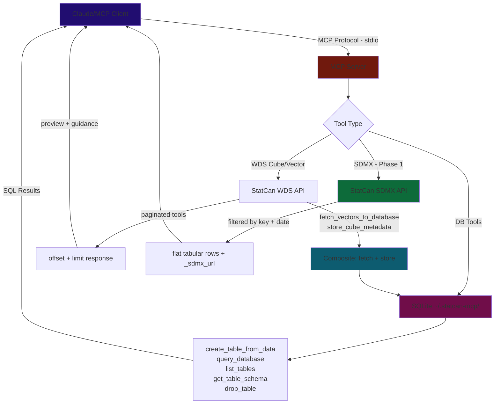
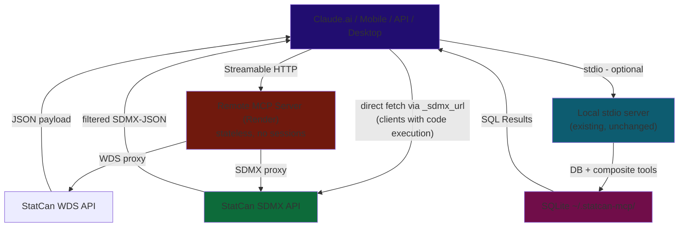

# Roadmap

*Updated Mar 1, 2026*

---

## Open Problems

### LLM Data Output — Hardcoded Values in Artifacts

**Problem observed:** When an LLM calls `get_sdmx_data` and receives 73 rows of CPI data, it hardcodes every value into the artifact (React dashboard) as literal arrays. This is error-prone, wastes context window, and prevents dynamic queries. The LLM should reference the data, not re-type it.

**Two Possible candidate approaches (either/or):**

#### Approach A — Downstream: `save_to_table`

Add an optional `save_to_table` parameter to `get_sdmx_data` and `get_sdmx_vector_data`. When provided, save all rows to SQLite and return only a 5-row head + table metadata. The LLM then uses `query_database` to get exactly the data it needs.

- **Works for:** stdio mode (has DB tools)
- **Doesn't help:** HTTP mode (no DB tools registered)
- **Complexity:** Low — reuses existing `create_table_from_data` pattern from `fetch_vectors_to_database`, and adding too many tools or complex server also bloats the LLM
- **Trade-off:** Data still gets embedded in artifacts from SQL results, but from clean targeted queries instead of raw dumps

#### Approach B — Upstream: URL + SDMX decoding context

The LLM already gets `_sdmx_url` in every SDMX tool response. The missing piece: it doesn't know how to decode SDMX-JSON compact format. If the LLM had that knowledge (via tool response hints, MCP Prompts, or a decoder snippet), it could write artifacts/sandbox code that fetches the URL at runtime and decodes it — data is never hardcoded, always live.

- **Works for:** HTTP mode, any client with code execution (analysis sandbox, Claude Code)
- **CORS blocker:** Browser-based artifacts cannot fetch StatCan directly (no CORS headers). Would need either:
  - A CORS proxy endpoint on the MCP HTTP server (e.g., `/sdmx/data/...` that proxies to StatCan with CORS headers)
  - Limiting to Python sandbox only (no CORS restriction for server-side requests)
- **Complexity:** Higher — requires SDMX-JSON decoding context in prompts/tool hints, or a proxy endpoint
- **Trade-off:** More powerful (live data, no hardcoding) but more moving parts

---

## Up Next

### Phase 2 — Streamable HTTP Transport (remaining)

Implementation and local dev complete. Remaining: deployment and verification.

- [ ] Deploy to Render free tier — auto-deploy from `main` branch
- [ ] Verify: Claude.ai Custom Connector can connect to the Render URL
- [ ] Verify: Claude iOS/Android can use the connector (add via claude.ai web, test on phone)
- [ ] Document the remote URL in README for users

#### Auth (evaluate, may defer)

- [ ] Start authless — StatCan data is public, no secrets involved
- [ ] Evaluate rate limiting (Render free tier has limits; StatCan API has its own)
- [ ] If needed later: add OAuth via MCP SDK auth support or simple API key header

---

### Phase 3 — MCP Resources & Prompts for SDMX

Expose SDMX URL construction as MCP primitives — supplementary to tools, not a replacement.

- **Resource template:** `sdmx://statcan/data/{productId}/{key}` → resolves to constructed SDMX URL + usage instructions
- **Prompt:** "SDMX data analysis" → reusable template with step-by-step URL construction guide, format notes, Python usage examples

These are additive — registered alongside tools in `create_server()`, no architectural change needed.

- [ ] Add `server.list_resources()` / `server.read_resource()` handlers
- [ ] Add `server.list_prompts()` / `server.get_prompt()` handlers
- [ ] SDMX URL construction prompt with Python usage examples

---

### Phase 4 — MCP Apps / Data Visualization

Return interactive HTML charts/dashboards in-chat via `ui://` resources.

Additive primitive — new module `src/api/app_tools.py` registered in `create_server()`. Visualization tools query local SQLite, so they live in the stdio server only (excluded from HTTP mode, consistent with DB tools split).

**Current blockers:**
- Python MCP SDK does not yet support MCP Apps (JS SDK only, as of Feb 2026)
- Requires HTTP transport (stdio cannot serve HTML resources back to client)
- Limited host support — few MCP clients render `ui://` resources

**Unblocked when:** Phase 2 deployed + Python SDK ships MCP Apps support.

---

## Backlog

### Quality

- [ ] **Enable SSL verification** — `VERIFY_SSL = False` is a security risk
- [ ] **CI/CD linting** — ruff + mypy on push/PR
- [ ] **Expand tests** — mock StatCan API responses; per-tool coverage (currently only truncation + sdmx_json tested)
- [ ] **Consolidate HTTP client usage** — most tools create inline `httpx.AsyncClient` instead of using a shared helper

### Distribution

- [ ] **Render deployment** — covered by Phase 2 remaining items
- [ ] **Register on Smithery.ai** — one-click install button
- [ ] **Submit to directories** — `punkpeye/awesome-mcp-servers`, PulseMCP
- [ ] **Multi-client config snippets** — Cursor, VS Code Copilot, Windsurf, Claude.ai Custom Connector in README
- [ ] **Windows setup guide** — needs testing on Windows VM first
- [ ] **Dockerfile** — for Docker MCP Catalog listing; also useful for Render (alternative to Procfile)

### Exploratory

- [ ] **A2A + MCP** — multi-agent system exploration
- [ ] **Scheduled reports** — periodic LLM calls for dataset summaries
- [ ] **Caching aligned to StatCan update schedule** — time-based invalidation at StatCan's 8:30 AM ET release cadence
- [ ] **Full cube pre-fetch** — download all cube metadata to local DB for fully offline browsing

## Architecture & Data Flow

### Current (stdio / local)

### Target (HTTP / stateless remote — Phase 2)

