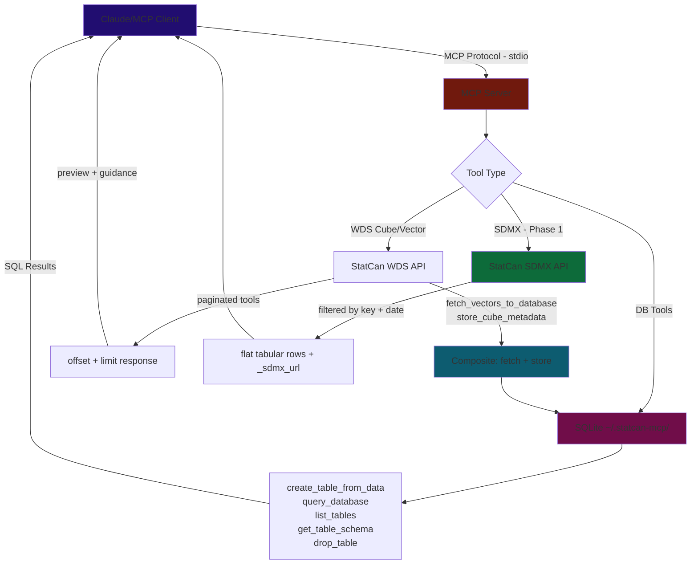
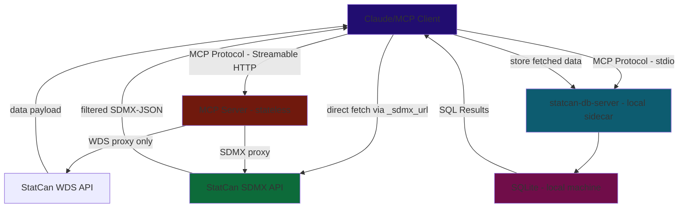

# Roadmap & Implementation Status
*Updated Feb 27, 2026*

---

## Completed

### Metadata Navigation Guidance — v0.2.1 *(Feb 26, 2026)*

**Problem observed:** An LLM session attempting to build a CPI + Labour Force dashboard hit a cascade of failures caused by metadata truncation and misleading guidance:

1. `summary=True` showed only 5 members per dimension — critical members like "Unemployment" (member 6) and "Unemployment rate" (member 7) were hidden. The LLM spent pages of reasoning guessing what coordinate positions meant.
2. `summary=False` produced 285KB of JSON — overflowed the context window. The client stored it to a file, forcing the LLM to install `jq` and write Python scripts to parse JSON-within-JSON (`data[0]['text']`).
3. The `_message` guidance said "get all members and their **vectorIds**" — but `getCubeMetadata` **does not return vectorIds** in member objects. VectorIds only come from `get_series_info_from_cube_pid_coord`. The LLM followed dead-end advice.
4. `_note` (top-level) and `_message` (per-dimension) were redundant, both saying "call with summary=False".
5. No guidance explained the coordinate-to-memberId mapping, so the LLM couldn't reason about which coordinate positions to use.

**Fixes applied:**
- [x] **`DEFAULT_MEMBER_LIMIT` 5 → 10** — shows more members before truncation
- [x] **Removed `_note`** — redundant with per-dimension `_message`
- [x] **Rewrote `_message` with actionable guidance** — explains coordinate position mapping, directs to `store_cube_metadata` and `get_series_info_from_cube_pid_coord`. Removed false vectorId claim.

**Key learning:** `getCubeMetadata` returns member names and hierarchy but **not vectorIds**. The three paths to vectorIds are:
1. `get_series_info_from_cube_pid_coord(productId, coordinate)` — resolve one coordinate at a time
2. `get_series_info_from_cube_pid_coord_bulk(items)` — resolve many coordinates in one call
3. `store_cube_metadata(productId)` → `query_database` — browse all members via SQL

### Context Window Overflow — v0.2.0 *(Feb 26, 2026)*
- [x] **`summarize_cube_metadata` default reduced 20 → 5** — `DEFAULT_MEMBER_LIMIT = 5` in `src/util/truncation.py`; 2 new tests added (15 total)
- [x] **Footnote stripping in summary mode** — replaces full `footnote` array with a count string
- [x] **`store_cube_metadata(pid)` composite tool** — fetches full metadata, stores into `_statcan_dimensions` + `_statcan_members`; returns compact summary only
- [x] **`get_cube_metadata` docstring updated** — points LLMs to `store_cube_metadata` for full member browsing without context cost

### Context Overflow & Truncation *(Feb 25, 2026)*
- [x] **Shared truncation utility** — `src/util/truncation.py`: `truncate_response`, `truncate_with_guidance`, `summarize_cube_metadata`; 13 unit tests
- [x] **`get_cube_metadata` summary mode** — `summary=True` (default) caps member lists; `summary=False` returns full response
- [x] **Cube list pagination** — `get_all_cubes_list` / `get_all_cubes_list_lite` paginated via `CubeListInput(offset, limit=100)`
- [x] **Search result cap** — `search_cubes_by_title` capped at `max_results=25`
- [x] **Bulk coord truncation + guidance** — `get_series_info_from_cube_pid_coord_bulk` paginates + injects `_guidance`
- [x] **Research: cursor-based pagination** — concluded it doesn't solve the problem; context overflow is caused by data accumulating in the window, not pagination inconsistency. Store-then-query is the correct direction.

### High-Priority Fixes *(Feb 25, 2026)*
- [x] **Bump `mcp>=1.3.0,<2`** — fixes protocol version mismatch; unlocks concurrent requests, Lifespan API, server `instructions` field
- [x] **Smart truncation for vector tools** — replaced auto-store with offset/limit pagination
- [x] **Bulk coord tool** — `get_series_info_from_cube_pid_coord_bulk` eliminates N sequential HTTP calls
- [x] **Registry `$defs` support** — `ToolRegistry` includes `$defs` in inputSchema for nested Pydantic models
- [x] **DB path fix** — `config.py` uses `pwd.getpwuid(os.getuid()).pw_dir`; `--db-path` CLI flag

### Core Data-Fetching Fixes *(Feb 25, 2026)*
- [x] `create_table_from_data` creates schema + inserts rows in one call
- [x] `fetch_vectors_to_database` composite tool — fetch + store in SQLite in a single call
- [x] Rewrote tool docstrings with workflow hints steering LLMs toward bulk vector pattern
- [x] Stable DB path at `~/.statcan-mcp/statcan_data.db`

### Distribution & Publishing *(Feb 23, 2026)*
- [x] PyPI — `pip install statcan-mcp-server` / `uvx statcan-mcp-server`; Trusted Publishing via GitHub OIDC
- [x] MCP Registry — `io.github.Aryan-Jhaveri/mcp-statcan`
- [x] GitHub Actions CI/CD — auto-publishes on push to `main`
- [x] Full StatCan WDS API coverage (~15 tools)
- [x] In-memory TTL cache for `search_cubes_by_title`
- [x] SQLite database layer — create, insert, query, list, schema, drop tools
- [x] `query_database` hardened — `PRAGMA query_only = ON` enforces read-only at SQLite engine level

---

## Up Next

### Phase 1 — SDMX Tools (`sdmx-http` branch from `main`)

#### Background: Why SDMX

The WDS API has a fundamental limitation: **no server-side dimensional filtering**. Every tool fetches a full payload and relies on post-fetch truncation. This creates unavoidable context bloat — large tool results sit in conversation history even when the LLM only needed a narrow slice.

StatCan's SDMX REST API (`https://www150.statcan.gc.ca/t1/wds/sdmx/statcan/rest/`) solves this at the source. Filtering is built into the URL path, so the response is already scoped before any bytes leave StatCan's servers.

**SDMX API reference:**
| Endpoint | URL pattern |
|---|---|
| Data (cube) | `/data/DF_{productId}/{key}?startPeriod=...&endPeriod=...&lastNObservations=...` |
| Data (vector) | `/vector/v{vectorId}?startPeriod=...&endPeriod=...` |
| Structure (DSD) | `/structure/Data_Structure_{productId}` |

The **key** is a dot-separated string of dimension codes (`1.2.7.0.0.0.0.0.0.0`). `+` for OR (`1.2+3.1`), omit for wildcard (`.1.138`). Response format: SDMX-JSON via `Accept: application/vnd.sdmx.data+json`. ProductId maps directly: table `18100004` → dataflow `DF_18100004`.

**Context window comparison:**
- WDS `getDataFromVectorByRange(vectorId, startDate, endDate)` → full time series → paginate after
- SDMX `/data/DF_18100004/1.2.7...?lastNObservations=12` → exactly 12 observations, one series, no truncation needed

#### Two-Pronged Strategy

**Prong 1 — WDS tools for exploration** *(existing, no change)*

`search_cubes`, `get_cube_metadata` (summary mode), `store_cube_metadata`, `get_series_info_from_cube_pid_coord`, `get_latest_n_data_from_vector`, etc. Small, context-safe responses. Used to identify what data exists, what dimensions/coordinates are available, and what vectorIds are needed.

**Prong 2 — SDMX tools for targeted data retrieval** *(new)*

Once the LLM knows what it wants (coordinates, vectorIds, date range), SDMX tools fetch exactly that slice. Responses are small because filtering happens at the API level. Every SDMX tool response includes an `_sdmx_url` field — clients with execution environments (Claude Code, Claude.ai analysis sandbox) can use this to fetch data directly, bypassing the MCP server and context window entirely.

**Example flow:**
```
[Explore — Prong 1]
1. search_cubes("CPI") → find productId 18100004
2. get_cube_metadata(18100004, summary=True) → dimension names + first 10 members each
3. get_series_info_from_cube_pid_coord(18100004, "1.2.7.0.0.0.0.0.0.0") → confirms coordinate, gets vectorId

[Fetch — Prong 2]
4. get_sdmx_data(18100004, "1.2.7.0.0.0.0.0.0.0", startPeriod="2020", lastNObservations=12)
   → 12 rows, already flat, context-safe
   → includes _sdmx_url for direct client-side access
```

> **Note:** The existing disabled `get_full_table_download_sdmx` WDS tool returns a URL for a *full unfiltered* table dump. SDMX REST is different — dimensional filtering returns only the slice needed.

#### SDMX Tools to Build (priority order)

**1. `get_sdmx_structure(productId)`**

Fetches the Data Structure Definition (DSD). Returns dimension names, positions, and codelist values in a summarized format — analogous to `get_cube_metadata(summary=True)` but following the SDMX standard. Critical for understanding valid dimension codes before building a query key.

Response: dimension list with `{name, position, codes: [{id, label}]}`. Apply member truncation like existing summary mode. Include `_sdmx_url` pointing to the full structure endpoint.

**2. `get_sdmx_data(productId, coordinate, startPeriod?, endPeriod?, lastNObservations?)`**

The core data-fetch tool. Accepts a WDS coordinate string (e.g., `"2.2.0.0.0.0.0.0.0.0"`) — the same format returned by `get_series_info_from_cube_pid_coord`. Internally strips trailing `.0` segments to produce the SDMX key (`"2.2"`). Fetches SDMX-ML XML, parses into flat tabular rows (one dict per observation). Apply `truncate_response`. Include `_sdmx_url`.

`+` for OR (`2.3+79` → Food OR Shelter in dimension 2), omit value for wildcard. Supports `lastNObservations` for narrowing to recent data.

**3. `get_sdmx_vector_data(vectorId, startPeriod?, endPeriod?, lastNObservations?)`**

Fetches a single time series by stable vectorId via SDMX. Simpler than the cube endpoint — no key construction needed. Supports `lastNObservations`. Complements existing WDS vector tools.

**4. `build_sdmx_url(productId, coordinate?, vectorId?, startPeriod?, endPeriod?, lastNObservations?)` *(optional)*

Pure URL construction — no fetch. Returns the constructed SDMX URL as a string. Useful for clients that want to fetch directly or embed in Python/Jupyter code. Could also be exposed as an MCP Prompt template instead of a tool.

#### Implementation Notes — Confirmed via Live API Testing (Feb 27, 2026)

**Response format: XML only.** Despite the `Accept: application/vnd.sdmx.data+json` header returning a JSON content-type header, the body is always SDMX-ML Generic Data XML. Must parse XML — not JSON.

**WDS coordinate → SDMX key:** WDS memberIds and SDMX codelist codes are the same numbering. Strip trailing `.0` segments from the WDS coordinate string to get the SDMX key:
- `"2.2.0.0.0.0.0.0.0.0"` → `"2.2"` (CPI: Canada + All-items)
- `"1.1.1.0.0.0.0.0.0.0"` → `"1.1.1"`
This means the LLM can use WDS memberIds (from `get_cube_metadata` or `store_cube_metadata`) directly as SDMX dimension codes — no separate lookup or translation needed.

**`lastNObservations` works on both endpoints** (data cube and vector). `startPeriod`/`endPeriod` work on both. Dates as `YYYY-MM`.

**SSL must be skipped** (`verify=False` in httpx — already the case in `config.py`).

**XML parse pattern** (SDMX-ML Generic Data):
```xml
<generic:Series>
  <generic:SeriesKey>
    <generic:Value id="Geography" value="2"/>
    <generic:Value id="Products_and_product_groups" value="2"/>
  </generic:SeriesKey>
  <generic:Attributes>
    <generic:Value id="VECTOR_ID" value="41690973"/>
  </generic:Attributes>
  <generic:Obs>
    <generic:ObsDimension value="2026-01"/>
    <generic:ObsValue value="165.0"/>
  </generic:Obs>
</generic:Series>
```
Flatten to: `[{Geography: 2, Products_and_product_groups: 2, vectorId: 41690973, period: "2026-01", value: 165.0}]`

**Structure endpoint** (`/structure/Data_Structure_{productId}`) only returns XML (`Accept: application/vnd.sdmx.structure+xml;version=2.1`). Contains codelists with dimension names and all valid codes. CPI (18100004) has 2 dimensions (Geography: 30 codes, Products: 359 codes), not 10.

**New file:** `src/api/sdmx_tools.py`, new models: `src/models/sdmx_models.py`. Use shared `httpx.AsyncClient` pattern from `client.py`. Register via existing `ToolRegistry` — no new infrastructure needed.

- [ ] `get_sdmx_structure(productId)`
- [ ] `get_sdmx_data(productId, key, startPeriod?, endPeriod?, lastNObservations?)`
- [ ] `get_sdmx_vector_data(vectorId, startPeriod?, endPeriod?)`
- [ ] `build_sdmx_url(...)` *(or expose as MCP Prompt)*

---

### Phase 2 — HTTP Transport (`sdmx-http` branch, after SDMX tools are stable)

#### Approach

Do **not** merge the stale `http` branch (Local production note) — it uses FastMCP which is unnecessary. The standard `mcp` SDK (>=1.3.0, already a dependency) supports Streamable HTTP transport. Build HTTP support directly on the existing `server.py` + `ToolRegistry` pattern.

**Stateless server architecture:**
- Server is a pure API proxy — fetches StatCan/SDMX data and returns it, stores nothing server-side
- DB tools excluded from HTTP mode (no per-user storage)
- Each client manages its own local SQLite via a separate `statcan-db-server` stdio sidecar (optional)
- SDMX tools are especially well-suited for HTTP mode — filtered responses, no storage needed
- Unlocks hosting on Render, Railway, Cloudflare Workers

**Implementation:**
- Add `--transport [stdio|http]` CLI flag to `server.py`
- In HTTP mode: skip `register_composite_tools` and `register_db_tools`
- Configure host/port via env vars or CLI args
- Auth: evaluate OAuth vs API key based on Python SDK support at implementation time

- [ ] Add `--transport` CLI flag; wire Streamable HTTP transport from `mcp` SDK
- [ ] Exclude DB/composite tools in HTTP mode
- [ ] Deploy to Render/Railway as a public free-tier instance
- [ ] Audit `fetch_vectors_to_database` and `store_cube_metadata` — provide pure-return variants for HTTP mode

---

### Phase 3 — MCP Resources & Prompts for SDMX *(after HTTP is stable)*

Expose SDMX URL construction as MCP primitives — supplementary to the SDMX tools, not a replacement.

- **Resource template:** `sdmx://statcan/data/{productId}/{key}` → resolves to the constructed SDMX URL and usage instructions
- **Prompt:** "SDMX data analysis" → reusable template with step-by-step URL construction guide, format notes, and `sdmx1`/`pandas` Python usage examples

These are additive — registered alongside tools in `create_server()`, no architectural change needed.

- [ ] Add `server.list_resources()` / `server.read_resource()` handlers
- [ ] Add `server.list_prompts()` / `server.get_prompt()` handlers
- [ ] SDMX URL construction prompt with Python usage examples

---

### Phase 4 — MCP Apps / Data Visualization *(post-HTTP, post-Python SDK support)*

Return interactive HTML charts/dashboards in-chat via `ui://` resources.

**No overhaul required.** MCP Apps are an additive primitive — registered alongside existing tools via a new handler, not a replacement for the existing architecture. The `ToolRegistry` pattern, all WDS tools, SDMX tools, and DB tools remain unchanged. Apps would be a new module (`src/api/app_tools.py`) registered in `create_server()` the same way as `register_cube_tools(registry)`.

**Architecture clarification — where visualization tools live:**

`visualize_table` queries *local* SQLite. This creates a hard split between the two server modes:

- **Local stdio server** — has SQLite. Visualization tools register here alongside DB tools. Works naturally.
- **Remote HTTP server** — stateless, no SQLite. Visualization tools are *excluded* from the HTTP build. Users who want charts use the local `statcan-db-server` stdio sidecar, where both DB tools and visualization tools live.

This is consistent with the existing DB split: remote HTTP server = API proxy only, local stdio sidecar = DB layer + everything that depends on it. Visualization is part of the DB layer, not the API layer.

**What this would look like:**
- `visualize_table(table_name, chart_type)` — queries local SQLite, returns interactive Chart.js or Plotly chart as MCP App resource *(local sidecar / stdio mode only)*
- `create_dashboard(tables, layout)` — multi-panel time series + bar charts + summary stats *(local only)*
- Text fallback for clients that don't render `ui://` resources

**Current blockers:**
- Python MCP SDK does not yet support MCP Apps (JS SDK only, as of Feb 2026)
- Requires HTTP transport (stdio cannot serve HTML resources back to client)
- Limited host support — few MCP clients render `ui://` resources

**Unblocked when:** Phase 2 (HTTP transport) is live + Python SDK ships MCP Apps support.

---

## Context Window / Chat Memory — Design Principles

The core tension: tool results must be in context for the LLM to reason about them, but context is finite, expensive, and accumulates silently across a session. Large tool results don't disappear — they sit in conversation history and inflate the cost of every subsequent API call.

**Three-layer defense:**

1. **Precision fetching at source (SDMX)** — dimensional filtering in the URL means smaller responses before any truncation. `lastNObservations=12` limits to one year of monthly data. `/data/DF_18100004/1.2.7.0.0.0.0.0.0.0` fetches one series, not a whole table.

2. **Summary-first pattern (existing + SDMX)** — return stats/schema by default, full data only on explicit request. `get_sdmx_structure` returns the schema without any observations. `get_cube_metadata(summary=True)` caps member lists.

3. **URL passthrough** — every SDMX tool response includes `_sdmx_url`. Clients with execution environments (Claude Code, Claude.ai analysis sandbox) can fetch outside the MCP context entirely — data never enters conversation history. Claude Desktop users without a sandbox fall back to tool-mediated fetching with truncation.

**How Claude.ai handles overflow (observed):**
When a tool result exceeds context limits, Claude.ai stores it at `/mnt/user-data/tool_results/statcan_{tool}_{id}.json` and returns a path. The file format is `[{"text": "<json-string>"}]` — requiring double-parse. The LLM then uses Python scripts in the analysis sandbox to navigate the file. This works but costs ~6 extra tool calls and significant reasoning overhead. The `store_cube_metadata` → `query_database` pattern avoids this by keeping the data in SQLite from the start.

---

## Quality

- [ ] **Enable SSL verification** — `VERIFY_SSL = False` is a security risk
- [ ] **CI/CD linting** — ruff + mypy on push/PR
- [ ] **Expand tests** — mock StatCan API responses; per-tool coverage (currently only truncation is tested)
- [ ] **Consolidate HTTP client usage** — most tools create inline `httpx.AsyncClient` instead of using shared `api/client.py` helpers

---

## Distribution

- [ ] **Register on Smithery.ai** — one-click install button
- [ ] **Submit to directories** — `punkpeye/awesome-mcp-servers`, PulseMCP
- [ ] **Multi-client config snippets** — Cursor, VS Code Copilot, Windsurf in README
- [ ] **Windows setup guide** — needs testing on Windows VM first
- [ ] **Dockerfile** — for Docker MCP Catalog listing

---

## Future / Exploratory

- [ ] **A2A + MCP** — multi-agent system exploration
- [ ] **Scheduled reports** — periodic LLM calls for dataset summaries
- [ ] **Caching aligned to StatCan update schedule** — time-based invalidation at StatCan's 8:30 AM ET release cadence
- [ ] **Full cube pre-fetch** — download all cube metadata to local DB for fully offline browsing (low priority; current search + on-demand fetch is sufficient)

---

## Architecture & Data Flow

### Current (stdio / local)



### Target (HTTP / stateless remote)


