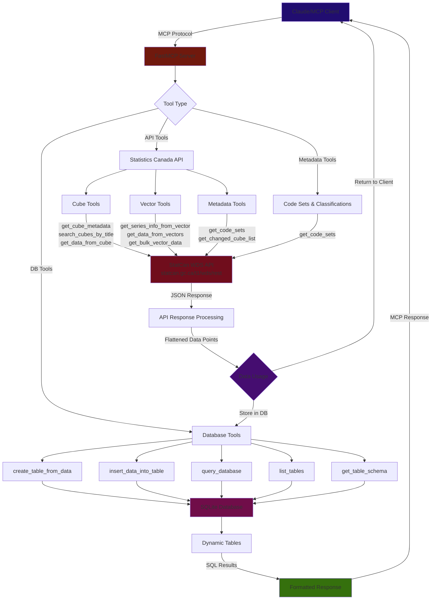

# IMPLEMENTATIONS.MD

# 🗺️ Roadmap & Ecosystem Alignment
*Updated Feb 24, 2026 — informed by MCP Apps, Registry, ecosystem best practices research, and LLM data-fetching behavior analysis*

---

## Priority Focus: Installation & LLM Data-Fetching Fixes

> These are the two highest-impact areas identified on Feb 24, 2026.
> Items below are ordered by priority within each focus area.

### Focus A: Make Installation Easier

Users can `pip install` / `uvx` the package, but still hit friction wiring it into their LLM client. The error logs from Feb 23 showed a misconfigured launch command with duplicate `-m src.server -m src.server` — exactly the kind of mistake manual config causes.

| # | Item | Effort | Status |
|---|------|--------|--------|
| A1 | **Add `claude mcp add` one-liner to README** — `claude mcp add statcan -- uvx statcan-mcp-server` auto-wires Claude Code with zero manual JSON editing. Also add ready-to-paste JSON for Claude Desktop: `{"mcpServers":{"statcan":{"command":"uvx","args":["statcan-mcp-server"]}}}` | ~30 min | [ ] |
| A2 | **Add multi-client config snippets** — Copy-paste JSON blocks for Claude Desktop, Claude Code, Cursor, VS Code Copilot, and Windsurf in the README. Each client has a different config format/location; document all of them. | ~1 hr | [ ] |
| A3 | **Register on Smithery.ai** — Smithery provides a "one-click install" button and handles config generation for users. Submit at smithery.ai. | ~30 min | [ ] |
| A4 | **Bump `mcp>=1.3.0` in `pyproject.toml`** — Server currently responds with protocol version `2025-06-18` while Claude sends `2025-11-25`. Bumping the SDK fixes the mismatch and enables newer MCP features (e.g., the `io.modelcontextprotocol/ui` extension the client advertised). | ~5 min | [ ] |
| A5 | **Submit to remaining directories** — PR to `punkpeye/awesome-mcp-servers` (syncs to Glama), submit to PulseMCP (`pulsemcp.com/submit`), consider Docker MCP Catalog. | ~1 hr | [ ] |

### Focus B: Fix LLM Data-Fetching Behavior

Three interrelated bugs all stem from the same root cause: **the tools aren't designed around how LLMs actually choose and chain tool calls.**

**The problems:**
- **B-Problem 1**: LLM fetches data one-by-one with `get_data_from_cube_pid_coord` instead of using bulk vector tools (observed Feb 23 — 5 separate calls for 5 provinces instead of 1 bulk call)
- **B-Problem 2**: `create_table_from_data` only creates the schema; LLM must make a second `insert_data_into_table` call. It often forgets, pasting raw numbers into its response instead.
- **B-Problem 3**: `get_bulk_vector_data_by_range` can return hundreds of data points, overflowing the LLM's working context.

**Root causes:**
- The coord-based tool has a simpler interface (one PID + one coord string) so the LLM gravitates to it over the bulk vector tools that require assembling an array of vector IDs.
- The two-step create+insert flow is invisible to the LLM as a required sequence — it treats each tool as independent.
- Tool descriptions are API-doc-style, not workflow-aware. They don't tell the LLM *when* to use each tool or *what to do next*.

| # | Fix | Solves | Effort | Status |
|---|-----|--------|--------|--------|
| B1 | **Merge `create_table_from_data` + `insert_data_into_table` into one step** — After `CREATE TABLE`, immediately insert the data that was passed in. Return `"Table 'x' created with N columns and M rows inserted."` Keep `insert_data_into_table` available for appending, but make the common "fetch then store" path a single tool call. *(changes in `src/db/schema.py`)* | B-Problem 2 | ~1 hr | [ ] |
| B2 | **Rewrite tool descriptions with workflow hints** — Current descriptions are API-doc-style. Add explicit steering. On `get_data_from_cube_pid_coord_and_latest_n_periods`: *"For fetching data across MULTIPLE provinces/categories, do NOT call this tool repeatedly. Instead: (1) get_cube_metadata to find vector IDs, (2) get_data_from_vector_by_reference_period_range with array of vectorIds, (3) create_table_from_data, (4) query_database."* On bulk tools: *"PREFERRED for multi-series fetches. Output is pre-flattened and ready for create_table_from_data."* | B-Problem 1 | ~1 hr | [ ] |
| B3 | **Add `fetch_vectors_to_database` composite tool** — New high-level tool that takes `vectorIds[]`, `table_name`, optional date range. Internally calls the vector range API, creates the table, inserts all data, and returns a summary (row count, columns, table name). Eliminates multi-step planning entirely — LLM just needs vector IDs and a table name. | B-Problem 1, 2 | ~2 hrs | [ ] |
| B4 | **Auto-store large responses and return summary** — When `get_bulk_vector_data_by_range` returns >50 rows, auto-store into a temp SQLite table and return `{"stored_in_table": "auto_bulk_xyz", "total_rows": 340, "columns": [...], "sample": [first 5 rows], "message": "Use query_database to analyze."}` instead of dumping all 340 rows into the LLM context. | B-Problem 3 | ~2 hrs | [ ] |
| B5 | **Add MCP Prompt templates for the correct workflow** — Register prompts like `analyze-statcan-data` that encode the pipeline: search cubes, get metadata for vector IDs, fetch_vectors_to_database, query_database. Gives LLMs a plan to follow instead of improvising tool sequences. | B-Problem 1 | ~2 hrs | [ ] |

---

## Tier 1: Foundational Fixes (Weekend Project)

- [x] **Create `pyproject.toml`** — Proper Python packaging with hatchling build backend, project metadata, dependencies, and console entry point (`statcan-mcp-server`). *(Completed)*
- [ ] **Enable SSL verification** — SSL is currently disabled for development. Fix httpx SSL settings and document any proxy/corporate certificate workarounds.
- [ ] **Harden SQL input validation** — Database tools accept raw SQL with "basic" validation. Implement: whitelist of allowed SQL operations (SELECT only), parameterized queries to prevent injection, and query size/timeout limits.
- [x] ~~**Add a uv or smithery package installer**~~ — Superseded by Focus A items above (A1 `claude mcp add`, A2 multi-client configs, A3 Smithery). *(carried from June 1, 2025; restructured Feb 24, 2026)*

## Tier 2: Ecosystem Integration (One-Week Sprint)

- [x] **Publish to PyPI** — Automated via GitHub Actions on tag push. Package: `statcan-mcp-server`. Install: `pip install statcan-mcp-server` / `uvx statcan-mcp-server`. Uses Trusted Publishing (OIDC). *(Completed Feb 23, 2026)*
- [x] **Register on Official MCP Registry** — `server.json` created and validated against schema. Registered as `io.github.aryan-jhaveri/mcp-statcan`. Automated publishing via `mcp-publisher` CLI with GitHub OIDC auth on tag push. *(Completed Feb 23, 2026)*
- [x] ~~**Submit to remaining directories**~~ — Moved to Focus A item A5 above. *(restructured Feb 24, 2026)*
- [x] **Add GitHub Actions CI/CD (release workflow)** — Publishes to PyPI and MCP Registry on tagged releases via `.github/workflows/publish-mcp-registry.yml`. Uses GitHub OIDC for both PyPI Trusted Publishing and MCP Registry auth. *(Completed Feb 23, 2026)*
- [ ] **Expand CI/CD with linting and type checking** — Add ruff, mypy, and tests on every push/PR. (DONT DO THIS YET - Because I need to polish up on CI/CD)
- [ ] **Create a Dockerfile** — Slim Python base image for sandboxed deployment. Enables Docker MCP Catalog listing. (DONT DO THIS YET - Because I need to polish up on Docker)
- [ ] **Create setup/installation guides for Windows** *(carried from June 1, 2025)* (DONT DO THIS YET - Because I need to test on windows virtual machine)

## Tier 3: Quality & Completeness (Two-Week Sprint)

- [ ] **Write tests** — Unit tests per tool function (pytest), mock StatCan API responses. Integration tests via FastMCP in-memory client. Test edge cases: empty results, API timeouts, malformed responses, pagination boundaries. Measure **tool hit rate** (LLM correctly picks right tool for 20 natural-language queries). (Need to research and plan)

- [ ] **Complete StatCan WDS API coverage** — The Web Data Service provides **15 methods**; implement all of them. Missing ones likely include `getAllCubesListLite`, `getCubeMetadata`, `getBulkVectorDataByRange`, `getChangedCubeList`, `getChangedSeriesDataFromVector`, etc. Each tool needs clear name, detailed description (explain StatCan "cubes" and "vectors" for LLMs), and well-defined input schema.
(There's trade offs between wds and sdmx tools, currently the LLM are fetching and readon one data point at a time maybe )

- [x] ~~**Add MCP Resources & Prompts**~~ — Moved to Focus B item B5 above for prompt templates. Resources remain here as a separate item below. *(restructured Feb 24, 2026)*

- [ ] **Add MCP Resources** — Expose **resources** for: available StatCan subject categories, StatCan data model explainer (cubes, vectors, coordinates, reference periods), API rate limits/constraints.
(Need subject matter experts to review)

- [ ] **Implement cursor-based pagination** — For tools returning large result sets, implement the MCP spec's pagination pattern with opaque cursor tokens and server-determined page sizes. Prevents timeouts on large queries.
(Need to research and plan and understand pagination and cursor tokens)

- [x] ~~Fix `get_bulk_vector` truncated output exceeding LLM context~~ — Superseded by Focus B item B4 (auto-store large responses). *(carried from Jan 7, 2026; restructured Feb 24, 2026)*

- [x] ~~Fix `create_table_from_data` not filling DB~~ — Superseded by Focus B item B1 (merge create+insert). *(carried from Jan 7, 2026; restructured Feb 24, 2026)*

- [x] ~~**Fix LLM defaulting to one-by-one `get_data_from_cube_pid_coord`**~~ — Superseded by Focus B items B2 (rewrite descriptions) + B3 (composite tool) + B5 (prompt templates). *(added Feb 23, 2026; restructured Feb 24, 2026)*

## Tier 4: Differentiation (Month-Long Effort)

- [ ] **Add MCP Apps support for data visualization** — Declare `ui://` resources that render interactive charts/tables. Time series → interactive Chart.js/Plotly chart in sandboxed iframe. Data tables → sortable/filterable HTML table. Use `ext-apps` SDK (`add-app-to-server` agent skill). Text fallback for non-supporting clients. Would make mcp-statcan one of the few data MCP servers with visual output.

- [ ] **Support Streamable HTTP transport** — Add HTTP server mode alongside stdio for remote deployment. Unlocks hosting on Cloudflare Workers, Render, Railway. Consider deploying a free public instance for zero-setup access.

- [ ] **Add structured output schemas** — Define typed output schemas for each tool's response, enabling downstream tools and MCP Apps UIs to parse results programmatically.
- [ ] **Implement caching** — StatCan data updates at 8:30 AM ET on business days. Cache API responses with time-based invalidation aligned to this schedule. Reduces StatCan API load, improves response times.

- [ ] **Look into SDMX implementation** — Allow Claude to create files or exact URIs for vector and metadata fetching; mix of REST and SDMX tools available *(carried from Jan 7, 2026)*

- [ ] **Maybe: Look into A2A + MCP** — (https://arxiv.org/pdf/2506.01804) to create an extended multi-agent system *(carried from June 3, 2025, only for curiosity)*

## Documentation Improvements

- [ ] **Badges section** — PyPI version, CI status, license, MCP registry link
- [ ] **Tool reference table** — Every tool with parameters, return types, example usage
- [ ] **CONTRIBUTING.md** with contribution guidelines
- [ ] **CHANGELOG.md** tracking versions
- [x] ~~**Multi-client config examples**~~ — Moved to Focus A item A2 above. *(restructured Feb 24, 2026)*
- [ ] **StatCan explainer section** — What StatCan data is and why it's useful, for international users

---

# 📓 Development Log

## February 24, 2026 — Installation & LLM Data-Fetching Analysis

Analyzed two focus areas and created actionable fix plan with 10 prioritized items (Focus A: 5 installation items, Focus B: 5 data-fetching items).

**Installation findings:**
- Users hit friction wiring the package into LLM clients despite `uvx` working. Manual JSON editing leads to misconfigs (e.g., duplicate `-m src.server` in launch command).
- `claude mcp add statcan -- uvx statcan-mcp-server` is the highest-leverage fix — zero-config for Claude Code.
- MCP SDK is behind (`2025-06-18` vs client's `2025-11-25`); bump `mcp>=1.3.0` to fix protocol mismatch.

**LLM data-fetching findings:**
- Root cause of one-by-one fetching: coord-based tool has simpler interface (1 PID + 1 coord) vs bulk tools (requires assembling vector ID arrays). LLMs pick the path of least resistance.
- Root cause of skipped DB insertion: `create_table_from_data` only creates schema — LLM must call `insert_data_into_table` separately. It often forgets.
- Root cause of context overflow: `get_bulk_vector_data_by_range` dumps all data points into the LLM context instead of routing through DB.
- **Fix strategy**: (B1) merge create+insert, (B2) rewrite tool descriptions with workflow hints, (B3) add composite `fetch_vectors_to_database` tool, (B4) auto-store large responses, (B5) add MCP prompt templates.

Restructured roadmap: moved carried-over items from Tiers 1/3 into new "Priority Focus" section with concrete implementation details.

## February 23, 2026 — PyPI & MCP Registry Publishing

[x] Created `server.json` validated against MCP Registry JSON schema (`io.github.aryan-jhaveri/mcp-statcan`).

[x] Added GitHub Actions workflow (`.github/workflows/publish-mcp-registry.yml`) for automated PyPI + MCP Registry publishing on `v*` tag push.

[x] Configured PyPI Trusted Publishing (OIDC) — no API tokens needed.

[x] Added `mcp-name` ownership verification marker to README.md.

[x] Enabled console script entry point (`statcan-mcp-server`) in `pyproject.toml`.

[x] Added sync `main()` wrapper in `server.py` for entry point compatibility (async logic preserved in `_async_main()`).

[x] Tagged `v0.1.1` and pushed to trigger first automated release pipeline.

## Jan 7, 2026

[x] Adjust and make more detailed tool prompts to prevent the LLM from making separate calls for finding data and then inputting to database.

[x] Need to add db specific math tools. Add additional graph tools if needed.

## January 2, 2026 — Refactor Data Retrieval Pipeline

[x] Identify issue with `get_bulk_vector_data_by_range` returning nested JSON incompatible with DB tools.

[x] **Priority** Shift strategy to **Flatten API Response**: Bulk Tool Flattening → Database Ingestion.

[x] Modify `get_bulk_vector_data_by_range` to return flat list of data points with `vectorId` injected.

[x] Ensure compatibility with `create_table_from_data` for seamless "Fetch → Store" workflow.

## Notes
- Potential use case: Create scheduled calls for the LLM to create weekly reports for specific data sets.

---

# 🏗️ Server Architecture & Data Flow
*June 1, 2025*

