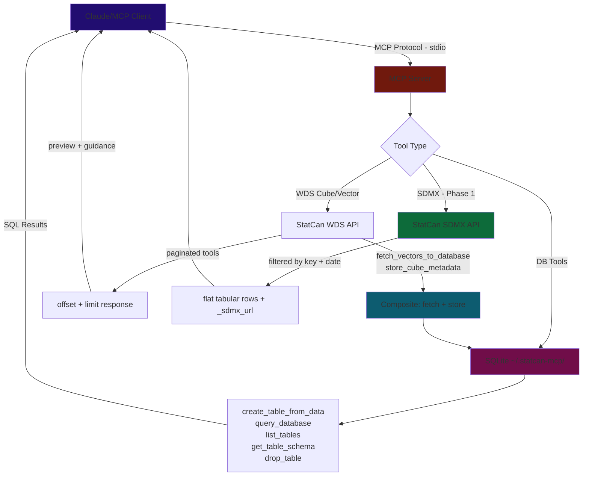
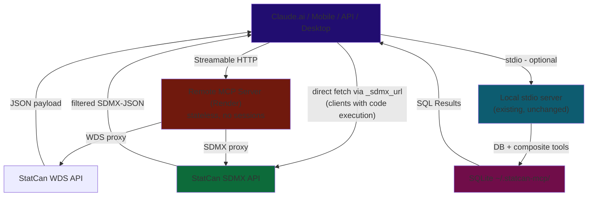

# Roadmap & Implementation Status
*Updated Feb 28, 2026*

---

## Up Next (Priority Order)

### Phase 2 — Streamable HTTP Transport

#### Goal

Make the server accessible remotely so any MCP client (Claude.ai web, Claude iOS/Android, API MCP Connector, third-party clients) can connect via a URL — no local installation required.

#### Why This Matters

- **Mobile**: Claude iOS/Android support remote MCP servers. Users add the URL once via claude.ai Settings > Connectors, it syncs to mobile automatically.
- **Web**: Claude.ai Custom Connectors connect to remote MCP servers via Streamable HTTP.
- **API**: The Claude API MCP Connector supports remote servers programmatically.
- **No install**: Users don't need Python, `uvx`, or `pip`. Just a URL.
- **93% of MCP servers** already use Streamable HTTP (the old SSE transport is deprecated as of spec revision 2025-03-26).

#### Architecture Decision: Stateless API Proxy

The remote server is **stateless** — every request is independent, no sessions, no server-side storage. This works because:

1. All WDS tools are pure API proxies (call StatCan, return JSON)
2. All SDMX tools are pure API proxies (call StatCan, return filtered data)
3. StatCan data is public — no per-user auth state needed
4. No SQLite on the server — DB tools are local-only

**Tools registered in HTTP mode** (~15 tools):
- WDS discovery: `search_cubes_by_title`, `get_all_cubes_list`, `get_all_cubes_list_lite`, `get_cube_metadata`, `get_code_sets`
- WDS series resolution: `get_series_info_from_cube_pid_coord`, `get_series_info_from_cube_pid_coord_bulk`
- WDS change detection: `get_changed_series_data_from_cube_pid_coord`, `get_changed_series_data_from_vector`, `get_changed_cube_list`, `get_changed_series_list`
- WDS data: `get_bulk_vector_data_by_range`
- SDMX: `get_sdmx_structure`, `get_sdmx_data`, `get_sdmx_vector_data`

**Tools excluded in HTTP mode** (require local SQLite):
- DB tools: `create_table_from_data`, `insert_data`, `query_database`, `list_tables`, `get_table_schema`, `drop_table`
- Composite tools: `fetch_vectors_to_database`, `store_cube_metadata`

Users who want DB/composite tools run the existing stdio server locally alongside the remote server. The remote server handles discovery + data fetch; the local server handles storage + SQL queries.

#### Technical Approach: `mcp` SDK 

Stay on the existing `mcp` SDK (`mcp>=1.8.0,<2`). The SDK provides Streamable HTTP transport via:

- `mcp.server.streamable_http_manager.StreamableHTTPSessionManager` — wraps our `Server` instance, manages HTTP request handling
- `mcp.server.streamable_http.StreamableHTTPServerTransport` — low-level per-request transport (created internally by the manager)

The `StreamableHTTPSessionManager` accepts `stateless=True`, which creates a fresh transport context per request — no session IDs, no affinity, horizontally scalable.

**No new dependencies.** `starlette` and `uvicorn` are already transitive dependencies of the `mcp` package.

**Key code pattern** (what `server.py` will look like for HTTP mode):

```python
from mcp.server import Server
from mcp.server.streamable_http_manager import StreamableHTTPSessionManager
from starlette.applications import Starlette
from starlette.routing import Mount
from starlette.middleware.cors import CORSMiddleware
import uvicorn, contextlib

server = Server("StatCanAPI_Server")
# ... register proxy tools only (no DB/composite) ...

session_manager = StreamableHTTPSessionManager(
    app=server,
    event_store=None,    # no resumability needed
    json_response=False, # SSE streaming (recommended)
    stateless=True,      # no session tracking
)

async def handle_mcp(scope, receive, send):
    await session_manager.handle_request(scope, receive, send)

@contextlib.asynccontextmanager
async def lifespan(app):
    async with session_manager.run():
        yield

app = Starlette(routes=[Mount("/mcp", app=handle_mcp)], lifespan=lifespan)
app = CORSMiddleware(app, allow_origins=["*"], allow_methods=["GET", "POST", "DELETE"],
                     expose_headers=["Mcp-Session-Id"])

uvicorn.run(app, host="0.0.0.0", port=int(os.environ.get("PORT", 8000)))
```

This is the same `Server` instance and `ToolRegistry` — only the transport layer changes.

#### Implementation Steps

**Step 1 — Dual-transport `server.py`**
- [ ] Add `--transport [stdio|http]` CLI arg (default: `stdio`)
- [ ] Add `--host` / `--port` CLI args (default: `0.0.0.0` / `8000`, also read from `HOST`/`PORT` env vars)
- [ ] Bump `mcp` floor to `>=1.8.0` in `pyproject.toml` (Streamable HTTP was added ~v1.8)
- [ ] In HTTP mode: skip `register_db_tools()` and `register_composite_tools()`
- [ ] In HTTP mode: create `StreamableHTTPSessionManager(stateless=True)` + Starlette app + uvicorn
- [ ] In stdio mode: existing behavior unchanged
- [ ] Add CORS middleware (required for browser-based MCP clients)

**Step 2 — Config & environment**
- [ ] Add `TRANSPORT`, `HOST`, `PORT` to `config.py` (env-var backed, with CLI override)
- [ ] Ensure `VERIFY_SSL=False` still works in HTTP mode (httpx calls to StatCan)
- [ ] Add health check endpoint at `/health` (Render needs this for deploy readiness)

**Step 3 — Deployment**
- [ ] Create `Procfile` or `render.yaml` for Render deployment
- [ ] Deploy to Render free tier — auto-deploy from `main` branch
- [ ] Verify: Claude.ai Custom Connector can connect to the Render URL
- [ ] Verify: Claude iOS/Android can use the connector (add via claude.ai web, test on phone)
- [ ] Document the remote URL in README for users

**Step 4 — Auth (evaluate, may defer)**
- [ ] Start authless — StatCan data is public, no secrets involved
- [ ] Evaluate rate limiting (Render free tier has limits; StatCan API has its own)
- [ ] If needed later: add OAuth via MCP SDK auth support or simple API key header

---

### Phase 3 — MCP Resources & Prompts for SDMX *(after HTTP is stable)*

Expose SDMX URL construction as MCP primitives — supplementary to the SDMX tools, not a replacement.

- **Resource template:** `sdmx://statcan/data/{productId}/{key}` → resolves to the constructed SDMX URL and usage instructions
- **Prompt:** "SDMX data analysis" → reusable template with step-by-step URL construction guide, format notes, and `sdmx1`/`pandas` Python usage examples

These are additive — registered alongside tools in `create_server()`, no architectural change needed.

- [ ] Add `server.list_resources()` / `server.read_resource()` handlers
- [ ] Add `server.list_prompts()` / `server.get_prompt()` handlers
- [ ] SDMX URL construction prompt with Python usage examples

---

### Phase 4 — MCP Apps / Data Visualization *(post-HTTP, post-Python SDK support)*

Return interactive HTML charts/dashboards in-chat via `ui://` resources.

**No overhaul required.** MCP Apps are an additive primitive — registered alongside existing tools via a new handler, not a replacement for the existing architecture. The `ToolRegistry` pattern, all WDS tools, SDMX tools, and DB tools remain unchanged. Apps would be a new module (`src/api/app_tools.py`) registered in `create_server()` the same way as `register_cube_tools(registry)`.

**Architecture clarification — where visualization tools live:**

`visualize_table` queries *local* SQLite. This creates a hard split between the two server modes:

- **Local stdio server** — has SQLite. Visualization tools register here alongside DB tools. Works naturally.
- **Remote HTTP server** — stateless, no SQLite. Visualization tools are *excluded* from the HTTP build. Users who want charts use the local `statcan-db-server` stdio sidecar, where both DB tools and visualization tools live.

This is consistent with the existing DB split: remote HTTP server = API proxy only, local stdio sidecar = DB layer + everything that depends on it. Visualization is part of the DB layer, not the API layer.

**Current blockers:**
- Python MCP SDK does not yet support MCP Apps (JS SDK only, as of Feb 2026)
- Requires HTTP transport (stdio cannot serve HTML resources back to client)
- Limited host support — few MCP clients render `ui://` resources

**Unblocked when:** Phase 2 (HTTP transport) is live + Python SDK ships MCP Apps support.

---

## Context Window / Chat Memory — Design Principles

The core tension: tool results must be in context for the LLM to reason about them, but context is finite, expensive, and accumulates silently across a session. Large tool results don't disappear — they sit in conversation history and inflate the cost of every subsequent API call.

**Three-layer defense:**

1. **Precision fetching at source (SDMX)** — dimensional filtering in the URL means smaller responses before any truncation. `lastNObservations=12` limits to one year of monthly data. `/data/DF_18100004/1.2.7.0.0.0.0.0.0.0` fetches one series, not a whole table.

2. **Summary-first pattern (existing + SDMX)** — return stats/schema by default, full data only on explicit request. `get_sdmx_structure` returns the schema without any observations. `get_cube_metadata(summary=True)` caps member lists.

3. **URL passthrough** — every SDMX tool response includes `_sdmx_url`. Clients with execution environments (Claude Code, Claude.ai analysis sandbox) can fetch outside the MCP context entirely — data never enters conversation history. Claude Desktop users without a sandbox fall back to tool-mediated fetching with truncation.

**How Claude.ai handles overflow (observed):**
When a tool result exceeds context limits, Claude.ai stores it at `/mnt/user-data/tool_results/statcan_{tool}_{id}.json` and returns a path. The file format is `[{"text": "<json-string>"}]` — requiring double-parse. The LLM then uses Python scripts in the analysis sandbox to navigate the file. This works but costs ~6 extra tool calls and significant reasoning overhead. The `store_cube_metadata` → `query_database` pattern avoids this by keeping the data in SQLite from the start.

---

## Quality

- [ ] **Enable SSL verification** — `VERIFY_SSL = False` is a security risk
- [ ] **CI/CD linting** — ruff + mypy on push/PR
- [ ] **Expand tests** — mock StatCan API responses; per-tool coverage (currently only truncation is tested)
- [ ] **Consolidate HTTP client usage** — most tools create inline `httpx.AsyncClient` instead of using shared `api/client.py` helpers

---

## Distribution

- [ ] **Render deployment** — covered by Phase 2 Step 3; free tier, auto-deploy from `main`
- [ ] **Register on Smithery.ai** — one-click install button
- [ ] **Submit to directories** — `punkpeye/awesome-mcp-servers`, PulseMCP
- [ ] **Multi-client config snippets** — Cursor, VS Code Copilot, Windsurf, Claude.ai Custom Connector in README
- [ ] **Windows setup guide** — needs testing on Windows VM first
- [ ] **Dockerfile** — for Docker MCP Catalog listing; also useful for Render (alternative to Procfile)

---

## Future / Exploratory

- [ ] **A2A + MCP** — multi-agent system exploration
- [ ] **Scheduled reports** — periodic LLM calls for dataset summaries
- [ ] **Caching aligned to StatCan update schedule** — time-based invalidation at StatCan's 8:30 AM ET release cadence
- [ ] **Full cube pre-fetch** — download all cube metadata to local DB for fully offline browsing (low priority; current search + on-demand fetch is sufficient)

---

## Architecture & Data Flow

### Current (stdio / local)



### Target (HTTP / stateless remote — Phase 2)



**Client access methods after Phase 2:**

| Client | Transport | DB Tools? | Setup |
|---|---|---|---|
| Claude.ai web | Streamable HTTP (remote) | No | Settings > Connectors > add URL |
| Claude iOS/Android | Streamable HTTP (remote) | No | Add via claude.ai web, syncs to mobile |
| Claude API (MCP Connector) | Streamable HTTP (remote) | No | Programmatic config |
| Claude Desktop | stdio (local) | Yes | `claude_desktop_config.json` |
| Claude Code / Cursor / VS Code | stdio (local) | Yes | Client MCP config |
| Any client + both servers | HTTP (remote) + stdio (local) | Yes | Both configured |

---

## Completed


#### Tool Cleanup *(done on `tool-cleanup` branch)*

- [x] Merged `get_series_info_from_cube_pid_coord` + `_bulk` → `get_series_info(items: list[{productId, coordinate}])` — both old tools deregistered (decorator commented), functions kept
- [x] Fixed `get_cube_metadata` docstring — corrected member cap (5→10), replaced `store_cube_metadata` reference with `get_sdmx_structure` (works in HTTP mode)
- [x] Fixed `get_bulk_vector_data_by_range` docstring — removed `fetch_vectors_to_database` / `create_table_from_data` references, replaced with pagination guidance

o
#### Phase 1 Progress

- [x] Add SDMX constants to `config.py` — `SDMX_BASE_URL`, `SDMX_JSON_ACCEPT`, `SDMX_XML_ACCEPT`, `MAX_SDMX_ROWS`
- [x] `src/util/sdmx_json.py` — `flatten_sdmx_json(data)` SDMX-JSON → tabular rows
- [x] `src/models/sdmx_models.py` — `SDMXStructureInput`, `SDMXDataInput`, `SDMXVectorInput`
- [x] `src/api/sdmx_tools.py` — `register_sdmx_tools(registry)` with 3 tools
- [x] Wire `register_sdmx_tools` into `server.py`
- [x] `get_sdmx_structure(productId)` — XML parse → JSON summary with codelist truncation
- [x] `get_sdmx_data(productId, key, startPeriod?, endPeriod?, lastNObservations?)` — JSON fetch + flatten
- [x] `get_sdmx_vector_data(vectorId, startPeriod?, endPeriod?, lastNObservations?)` — JSON fetch + flatten
- [x] Deregister `get_data_from_cube_pid_coord_and_latest_n_periods` (comment out `@registry.tool()` in `cube_tools.py`)
- [x] Deregister `get_data_from_vectors_and_latest_n_periods` (comment out `@registry.tool()` in `vector_tools.py`)
- [x] Deregister `get_data_from_vector_by_reference_period_range` (comment out `@registry.tool()` in `vector_tools.py`)
- [ ] `build_sdmx_url(...)` *(optional, deferred to Phase 3 Prompts)*


### Phase 1 Complete — SDMX Tools + Bug Fixes *(Feb 28, 2026)*

- [x] `SDMX_BASE_URL`, `SDMX_JSON_ACCEPT`, `SDMX_XML_ACCEPT`, `MAX_SDMX_ROWS` added to `config.py`
- [x] `src/util/sdmx_json.py` — `flatten_sdmx_json(data)`: SDMX-JSON → tabular rows. Handles series dims, obs dims, series/obs attrs. `_deref()` for safe index lookup. Obs-level attributes take priority on name collision.
- [x] `src/models/sdmx_models.py` — `SDMXStructureInput`, `SDMXDataInput`, `SDMXVectorInput`
- [x] `src/api/sdmx_tools.py` — 3 tools: `get_sdmx_structure`, `get_sdmx_data`, `get_sdmx_vector_data`
- [x] `server.py` — `register_sdmx_tools` wired in
- [x] 3 WDS data-fetch tools deregistered (decorator commented, functions kept)
- [x] **Bug 1**: Monthly period — duplicate ID detection → `start[:7]`; annual keeps bare year
- [x] **Bug 2**: `lastNObservations` + `startPeriod/endPeriod` → clear ValueError; docstrings updated
- [x] **Bug 3** (partial): Global obs_key overflow fixed via `obs_idx % n_period_vals`. Geography labels for OR-key series 2+ remain wrong (StatCan API bug) — wildcard recommended
- [x] Tests: `tests/test_sdmx_json.py` (7 tests); 22/22 passing

### Metadata Navigation Guidance — v0.2.1 *(Feb 26, 2026)*

**Problem observed:** An LLM session attempting to build a CPI + Labour Force dashboard hit a cascade of failures caused by metadata truncation and misleading guidance:

1. `summary=True` showed only 5 members per dimension — critical members like "Unemployment" (member 6) and "Unemployment rate" (member 7) were hidden. The LLM spent pages of reasoning guessing what coordinate positions meant.
2. `summary=False` produced 285KB of JSON — overflowed the context window. The client stored it to a file, forcing the LLM to install `jq` and write Python scripts to parse JSON-within-JSON (`data[0]['text']`).
3. The `_message` guidance said "get all members and their **vectorIds**" — but `getCubeMetadata` **does not return vectorIds** in member objects. VectorIds only come from `get_series_info_from_cube_pid_coord`. The LLM followed dead-end advice.
4. `_note` (top-level) and `_message` (per-dimension) were redundant, both saying "call with summary=False".
5. No guidance explained the coordinate-to-memberId mapping, so the LLM couldn't reason about which coordinate positions to use.

**Fixes applied:**
- [x] **`DEFAULT_MEMBER_LIMIT` 5 → 10** — shows more members before truncation
- [x] **Removed `_note`** — redundant with per-dimension `_message`
- [x] **Rewrote `_message` with actionable guidance** — explains coordinate position mapping, directs to `store_cube_metadata` and `get_series_info_from_cube_pid_coord`. Removed false vectorId claim.

**Key learning:** `getCubeMetadata` returns member names and hierarchy but **not vectorIds**. The three paths to vectorIds are:
1. `get_series_info_from_cube_pid_coord(productId, coordinate)` — resolve one coordinate at a time
2. `get_series_info_from_cube_pid_coord_bulk(items)` — resolve many coordinates in one call
3. `store_cube_metadata(productId)` → `query_database` — browse all members via SQL

### Context Window Overflow — v0.2.0 *(Feb 26, 2026)*
- [x] **`summarize_cube_metadata` default reduced 20 → 5** — `DEFAULT_MEMBER_LIMIT = 5` in `src/util/truncation.py`; 2 new tests added (15 total)
- [x] **Footnote stripping in summary mode** — replaces full `footnote` array with a count string
- [x] **`store_cube_metadata(pid)` composite tool** — fetches full metadata, stores into `_statcan_dimensions` + `_statcan_members`; returns compact summary only
- [x] **`get_cube_metadata` docstring updated** — points LLMs to `store_cube_metadata` for full member browsing without context cost

### Context Overflow & Truncation *(Feb 25, 2026)*
- [x] **Shared truncation utility** — `src/util/truncation.py`: `truncate_response`, `truncate_with_guidance`, `summarize_cube_metadata`; 13 unit tests
- [x] **`get_cube_metadata` summary mode** — `summary=True` (default) caps member lists; `summary=False` returns full response
- [x] **Cube list pagination** — `get_all_cubes_list` / `get_all_cubes_list_lite` paginated via `CubeListInput(offset, limit=100)`
- [x] **Search result cap** — `search_cubes_by_title` capped at `max_results=25`
- [x] **Bulk coord truncation + guidance** — `get_series_info_from_cube_pid_coord_bulk` paginates + injects `_guidance`
- [x] **Research: cursor-based pagination** — concluded it doesn't solve the problem; context overflow is caused by data accumulating in the window, not pagination inconsistency. Store-then-query is the correct direction.

### High-Priority Fixes *(Feb 25, 2026)*
- [x] **Bump `mcp>=1.3.0,<2`** — fixes protocol version mismatch; unlocks concurrent requests, Lifespan API, server `instructions` field
- [x] **Smart truncation for vector tools** — replaced auto-store with offset/limit pagination
- [x] **Bulk coord tool** — `get_series_info_from_cube_pid_coord_bulk` eliminates N sequential HTTP calls
- [x] **Registry `$defs` support** — `ToolRegistry` includes `$defs` in inputSchema for nested Pydantic models
- [x] **DB path fix** — `config.py` uses `pwd.getpwuid(os.getuid()).pw_dir`; `--db-path` CLI flag

### Core Data-Fetching Fixes *(Feb 25, 2026)*
- [x] `create_table_from_data` creates schema + inserts rows in one call
- [x] `fetch_vectors_to_database` composite tool — fetch + store in SQLite in a single call
- [x] Rewrote tool docstrings with workflow hints steering LLMs toward bulk vector pattern
- [x] Stable DB path at `~/.statcan-mcp/statcan_data.db`

### Distribution & Publishing *(Feb 23, 2026)*
- [x] PyPI — `pip install statcan-mcp-server` / `uvx statcan-mcp-server`; Trusted Publishing via GitHub OIDC
- [x] MCP Registry — `io.github.Aryan-Jhaveri/mcp-statcan`
- [x] GitHub Actions CI/CD — auto-publishes on push to `main`
- [x] Full StatCan WDS API coverage (~15 tools)
- [x] In-memory TTL cache for `search_cubes_by_title`
- [x] SQLite database layer — create, insert, query, list, schema, drop tools
- [x] `query_database` hardened — `PRAGMA query_only = ON` enforces read-only at SQLite engine level

---
