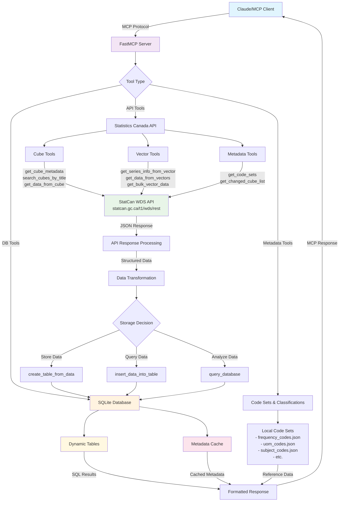

# Implementations List
List of ideas for future implementations and improvements to the server

## June 1, 2025
[] add a uv or smithery package installer, to install packages to claude or other LLM clients directly instead of having to adjust working directories

[] Create a setup installation guides for windows.

[] Adjust and make more detailed tool prompts to prevent the LLM from making separate calls for finding data and then inputting to database.

[] Need to add db specific math tools [I am concerned if there is enough relevant math tools available for the database], add additional graph tools if needed.

## Notes 
- Potential use case: Create an scheduled calls for the LLM to create weekly reports for specific data sets.

## Server Architecture & Data Flow
June 1,2025

