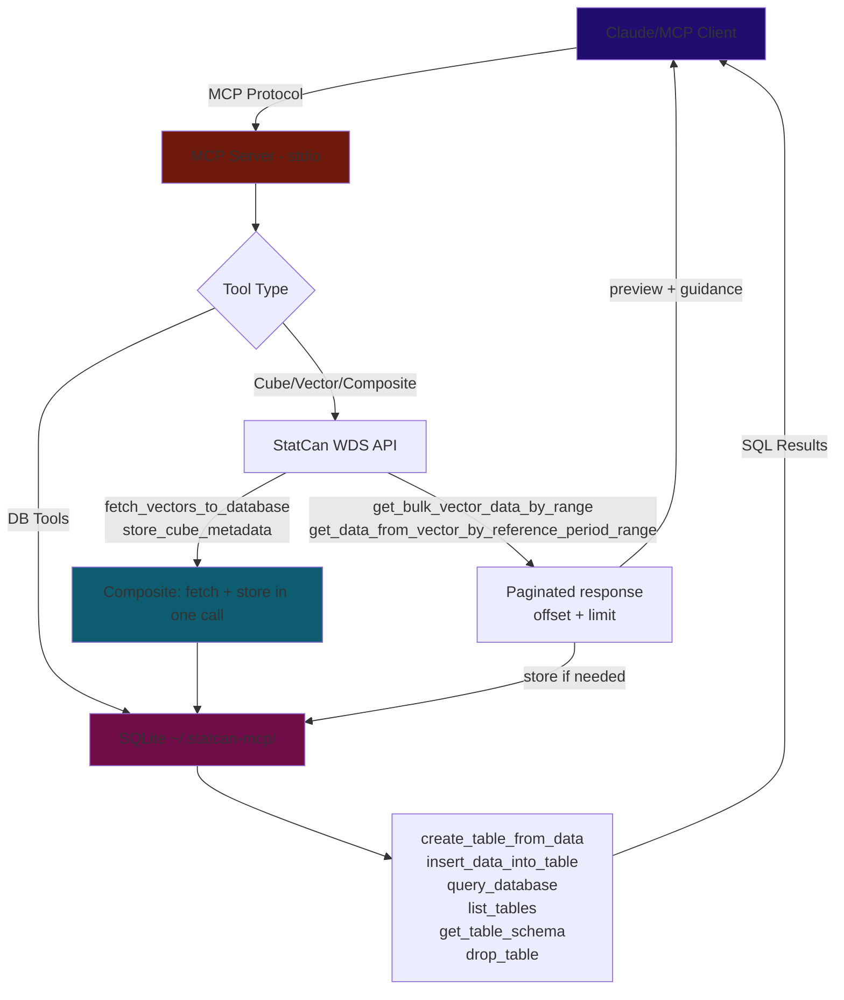
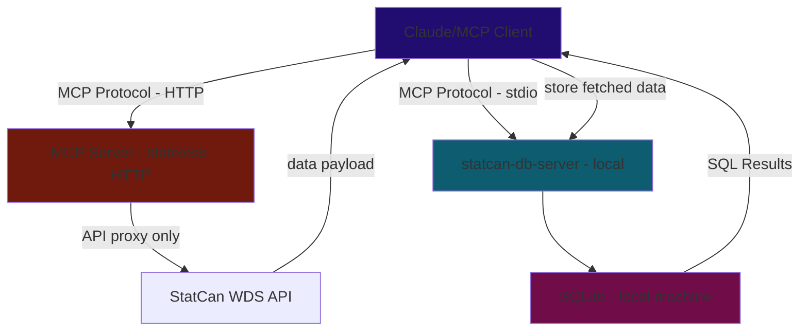

# Roadmap & Implementation Status
*Updated Feb 26, 2026*

---

## Current Problem

### Metadata Navigation Guidance — v0.2.1 

**Problem observed:** An LLM session attempting to build a CPI + Labour Force dashboard hit a cascade of failures caused by metadata truncation and misleading guidance:

1. `summary=True` showed only 5 members per dimension — critical members like "Unemployment" (member 6) and "Unemployment rate" (member 7) were hidden. The LLM spent pages of reasoning guessing what coordinate positions meant.
2. `summary=False` produced 285KB of JSON — overflowed the context window. The client stored it to a file, forcing the LLM to install `jq` and write Python scripts to parse JSON-within-JSON (`data[0]['text']`).
3. The `_message` guidance said "get all members and their **vectorIds**" — but `getCubeMetadata` **does not return vectorIds** in member objects. VectorIds only come from `get_series_info_from_cube_pid_coord`. The LLM followed dead-end advice.
4. `_note` (top-level) and `_message` (per-dimension) were redundant, both saying "call with summary=False".
5. No guidance explained the coordinate-to-memberId mapping, so the LLM couldn't reason about which coordinate positions to use.

**Changes/Potential Fixes applied:**
- [x] **`DEFAULT_MEMBER_LIMIT` 5 → 10** — shows more members before truncation, enough to cover most dimension hierarchies (e.g., LFS has ~10 labour force characteristics)
- [x] **Removed `_note`** — redundant with per-dimension `_message` and the footnote's own inline message. `_summary: true` is sufficient to signal summary mode.
- [x] **Rewrote `_message` with actionable guidance** — now explains coordinate position mapping (`dimensionPositionId` → coordinate string position, `memberId` → value at that position), directs to `store_cube_metadata` for full browsing, and `get_series_info_from_cube_pid_coord` for coordinate resolution. Removed the false claim about vectorIds.

**Key learning:** `getCubeMetadata` returns member names and hierarchy but **not vectorIds**. The three paths to vectorIds are:
1. `get_series_info_from_cube_pid_coord(productId, coordinate)` — resolve one coordinate at a time
2. `get_series_info_from_cube_pid_coord_bulk(items)` — resolve many coordinates in one call
3. `store_cube_metadata(productId)` → `query_database` — browse all members via SQL

More detailed prompts might help LLMS know exactly the next steps

## Up Next — Infrastructure

### 1. HTTP Branch — Catch Up + Stateless Architecture

The `http` branch has Streamable HTTP + Google OAuth but is behind `main` by several versions. Before adding features it needs to merge everything from `main`.

**Potential architecture (stateless server):**
- Server is a pure API proxy — fetches StatCan data and returns it, stores nothing server-side
- DB tools are excluded from the HTTP build entirely.
- Each user's client manages its own local SQLite.
- This unlocks hosting on Render, Railway, Cloudflare Workers without per-user storage concerns.
- Required for MCP Apps (needs HTTP transport).

- [ ] `main` is ahead and has more tools, `http` is stale and old branch.

- [ ] Audit composite tools — `fetch_vectors_to_database` and `store_cube_metadata` use local SQLite; exclude or replace with pure-return variants for HTTP mode

- [ ] Verify Google OAuth flow still works after merge
- [ ] Deploy to Render/Railway as a public free-tier instance

### 2. Client-Side Storage & Large Result Handling

#### Observed: Claude.ai's Analysis Environment

A specific chat session for CPI/LFS dashboard revealed how Claude.ai handles tool results that exceed context limits:

1. **File-based overflow** — When `get_cube_metadata(summary=False)` returned 285KB, the client stored it at `/mnt/user-data/tool_results/statcan_get_cube_metadata_toolu_<id>.json` and returned a message: *"Tool result too large for context, stored at [path]. Use grep to search for specific content or head/tail to read portions."*

2. **File format** — The stored file is a JSON array: `[{"text": "<json-string>"}]`. The actual metadata is a JSON string inside the `text` field — requiring double-parse (`json.loads(data[0]['text'])`).

3. **LLM navigation** — The LLM used Python scripts in the analysis sandbox to parse the file, search for members by keyword, and build coordinate strings. It installed `jq` and wrote hierarchical tree walkers to navigate the 359-member product dimension.

4. **What worked** — Once the LLM could run Python against the full metadata file, it successfully built a searchable product catalog and resolved coordinates.

5. **What didn't work** — The intermediate steps were expensive: ~6 tool calls and significant reasoning just to parse the file format and understand the member hierarchy.

**Takeaway for server design:** The `store_cube_metadata` composite tool solves this by storing metadata in SQLite *server-side* before it reaches the client. The LLM can then `query_database("SELECT memberNameEn, memberId FROM _statcan_members WHERE productId = 18100004 AND dimensionId = 2 AND memberNameEn LIKE '%unemployment%'")` instead of parsing 285KB of JSON. This works in both stdio and HTTP modes — the question is where the SQLite lives.

#### Remote Use Case — Two-Pronged Strategy

When the server is remote and stateless, the LLM needs two things: a way to explore and navigate data (small responses, context-safe), and a way to fetch large datasets for analysis without flooding the context window. These map to two distinct tool surfaces that can coexist.

---

**Prong 1 — WDS tools for exploration & research** *(existing tool surface)*

The current WDS tools handle discovery and navigation: `search_cubes`, `get_cube_metadata` (summary mode), `store_cube_metadata`, `get_series_info_from_cube_pid_coord`, `get_latest_n_data_from_vector`, etc. Responses are truncated and context-safe. The LLM uses these to understand what data exists, what dimensions/members are available, and what coordinates or vector IDs it needs.

In HTTP mode, DB tools (`store_cube_metadata`, `query_database`) are excluded from the remote server — they move to a local `statcan-db-server` sidecar if the user wants the store-then-query pattern locally. Without it, the LLM uses summary-mode tools for exploration only and pivots to Prong 2 for actual data retrieval.

---

**Prong 2 — SDMX as MCP Resources/Prompts for data analysis** *(new surface)*

Once the LLM has identified what it wants (coordinates, vector IDs, date range), instead of fetching data through the MCP server, it constructs or receives a precisely-filtered SDMX REST URL. The SDMX REST API at `https://www150.statcan.gc.ca/t1/wds/sdmx/statcan/rest/` covers the full StatCan dataset in a standard format (ISO 17369) with dimensional filtering built into the URL path.

The server exposes SDMX URL construction as **MCP Resources or Prompts** rather than tools — giving the LLM a reusable, guided pattern for building the correct URL from the coordinates it already identified via Prong 1. The LLM then fetches the data client-side (Python sandbox, `curl`, `pandas`, `sdmx1` library) without any data transiting through the server or context window.

*SDMX REST endpoints:*
- **Data by cube:** `/data/DF_{productId}/{dimensionalKey}?startPeriod=...&endPeriod=...` — dot-separated dimensional key, `+` for OR, wildcard by omission
- **Data by vector:** `/vector/v{vectorId}` — same stable vector IDs used by WDS
- **Formats:** SDMX-JSON, SDMX-ML 2.1 — self-describing, standard parsers available

*Example flow:*
```
[Explore — Prong 1]
1. LLM → server: search_cubes("CPI")
2. LLM → server: get_cube_metadata(18100004, summary=True)
3. LLM → server: get_series_info_from_cube_pid_coord(18100004, "1.2.7.0.0.0.0.0.0.0")
   → resolves vectorId, confirms coordinate is valid

[Fetch — Prong 2]
4. LLM uses MCP Resource/Prompt to construct SDMX URL:
   "https://www150.statcan.gc.ca/t1/wds/sdmx/statcan/rest/data/DF_18100004/1.2.7.0.0.0.0.0.0.0?startPeriod=2020"
5. LLM downloads + analyzes directly — data never touches the MCP server
```

*Why MCP Resources/Prompts rather than a tool:*
- URL construction is deterministic once coordinates are known — no server-side logic needed
- A prompt template or resource gives the LLM a reusable, well-documented pattern it can apply independently
- Keeps the server truly stateless — no fetch, no relay, no storage
- Also useful for users who want to write their own Python/Jupyter code using SDMX

*Limitation:* Requires a client with an execution environment (Claude.ai analysis sandbox, Claude Code). Claude Desktop without a sandbox cannot fetch URLs — those users need the local `statcan-db-server` sidecar (Prong 1 + local DB).

> **Ref:** StatCan SDMX User Guide — https://www.statcan.gc.ca/en/developers/sdmx/user-guide
> **Note:** The existing disabled `get_full_table_download_sdmx` WDS tool returns a download URL for a *full unfiltered* table. This is different — SDMX REST supports dimensional filtering so the client only downloads the slice it needs.

---


### 3. MCP Apps — Data Visualization *(post-HTTP)*

Return interactive HTML charts/dashboards in-chat.
Limitations: 
- No Python MCP SDK support yet (JS only as of Feb 2026)
- Requires HTTP transport (stdio can't serve HTML resources back)
- Limited host support — only a few MCP clients render `ui://` resources

**What this would look like:**
- `visualize_table(table_name, chart_type)` — queries local SQLite, returns an interactive Chart.js or Plotly chart as an MCP App resource
- `create_dashboard(tables, layout)` — multi-panel view combining time series, bar charts, and summary stats
- Text fallback for clients that don't support MCP Apps

**Unblocked when:** HTTP branch is stable + Python SDK ships MCP Apps support.

---

## Quality

- [ ] **Enable SSL verification** — `VERIFY_SSL = False` is a security risk
- [ ] **CI/CD linting** — ruff + mypy on push/PR
- [ ] **Expand tests** — mock StatCan API responses; per-tool coverage (currently only truncation is tested)

---

## Distribution

- [ ] **Register on Smithery.ai** — one-click install button
- [ ] **Submit to directories** — `punkpeye/awesome-mcp-servers`, PulseMCP
- [ ] **Multi-client config snippets** — Cursor, VS Code Copilot, Windsurf in README
- [ ] **Windows setup guide** — needs testing on Windows VM first
- [ ] **Dockerfile** — for Docker MCP Catalog listing

---

## Future / Exploratory

- [ ] **A2A + MCP** — multi-agent system exploration
- [ ] **Test Scheduled reports generation** — periodic LLM calls for dataset summaries and generations. 
- [ ] **Caching** — time-based invalidation aligned to StatCan's 8:30 AM ET update schedule. If Local DB is implemented, maybe downlaod all get_cube to allow llms to query all cubes efficiently (currently not needed)
- [ ] **MCP Resources/Prompts for SDMX** — Expose SDMX URL construction as MCP Resources or Prompts (see Section 2, Prong 2). A middle path: WDS tools for exploration, SDMX for client-side data analysis — gradually reducing reliance on local SQLite for clients with execution environments. Local SQLite remains valuable for remote-server or local-only deployments where the client has no sandbox.

---

## Completed

### Context Window Overflow — v0.2.0 *(Feb 26, 2026)*
- [x] **`summarize_cube_metadata` default reduced 20 → 5** — `DEFAULT_MEMBER_LIMIT = 5` in `src/util/truncation.py`; 2 new tests added (15 total)
- [x] **Footnote stripping in summary mode** — `summarize_cube_metadata` replaces the full `footnote` array with a count string (e.g., `"[20 footnotes omitted. Set summary=False to include them.]"`). Footnotes were the dominant response size contributor on data-rich cubes like CPI (18100004).
- [x] **`store_cube_metadata(pid)` composite tool** — fetches full metadata, stores into `_statcan_dimensions` + `_statcan_members`; returns compact summary only. Tables shared across pids, idempotent via `DELETE WHERE pid = ?`. Lives in `composite_tools.py` alongside `fetch_vectors_to_database`.
- [x] **`get_cube_metadata` docstring updated** — now points LLMs to `store_cube_metadata` for full member browsing without context cost

### Context Overflow & Truncation *(Feb 25, 2026)*
- [x] **Shared truncation utility** — `src/util/truncation.py`: `truncate_response`, `truncate_with_guidance`, `summarize_cube_metadata`; 13 unit tests
- [x] **`get_cube_metadata` summary mode** — `summary=True` (default) caps dimension member lists at 5; `summary=False` returns full response with all vectorIds and footnotes
- [x] **Cube list pagination** — `get_all_cubes_list` / `get_all_cubes_list_lite` paginated via `CubeListInput(offset, limit=100)`
- [x] **Search result cap** — `search_cubes_by_title` via `CubeSearchInput(max_results=25)`; count message when more exist
- [x] **Bulk coord truncation + guidance** — `get_series_info_from_cube_pid_coord_bulk` paginates + injects `_guidance` for code-set resolution
- [x] **Research: cursor-based pagination** — concluded it doesn't solve the problem; context overflow is caused by data accumulating in the window, not pagination inconsistency. Store-then-query is the correct direction.

### High-Priority Fixes *(Feb 25, 2026)*
- [x] **Bump `mcp>=1.3.0,<2`** — fixes protocol version mismatch; unlocks concurrent requests, Lifespan API, server `instructions` field
- [x] **Smart truncation for vector tools** — replaced auto-store with offset/limit pagination in `get_bulk_vector_data_by_range` and `get_data_from_vector_by_reference_period_range`
- [x] **Bulk coord tool** — `get_series_info_from_cube_pid_coord_bulk` accepts array of `{productId, coordinate}` pairs; eliminates N sequential HTTP calls
- [x] **Registry `$defs` support** — `ToolRegistry` includes `$defs` in inputSchema for nested Pydantic models
- [x] **DB path fix** — `config.py` uses `pwd.getpwuid(os.getuid()).pw_dir` instead of `os.path.expanduser`; `--db-path` CLI flag

### Core Data-Fetching Fixes *(Feb 25, 2026)*
- [x] `create_table_from_data` creates schema + inserts rows in one call
- [x] `fetch_vectors_to_database` composite tool — fetch + store in SQLite in a single call
- [x] Rewrote tool docstrings with workflow hints steering LLMs toward bulk vector pattern
- [x] Stable DB path at `~/.statcan-mcp/statcan_data.db`

### Distribution & Publishing *(Feb 23, 2026)*
- [x] PyPI — `pip install statcan-mcp-server` / `uvx statcan-mcp-server`; Trusted Publishing via GitHub OIDC
- [x] MCP Registry — `io.github.Aryan-Jhaveri/mcp-statcan`
- [x] GitHub Actions CI/CD — auto-publishes on push to `main`
- [x] Flatten `get_bulk_vector_data_by_range` — flat list with `vectorId` injected per data point
- [x] Full StatCan WDS API coverage (~15 tools)
- [x] In-memory TTL cache for `search_cubes_by_title`
- [x] SQLite database layer — create, insert, query, list, schema, drop tools
- [x] `drop_table` MCP tool — LLMs can permanently delete tables to free DB space
- [x] `query_database` hardened — `PRAGMA query_only = ON` enforces read-only at SQLite engine level

---

## Architecture & Data Flow

### Current (stdio / local)



### Target (HTTP / remote + client-side SQLite)


