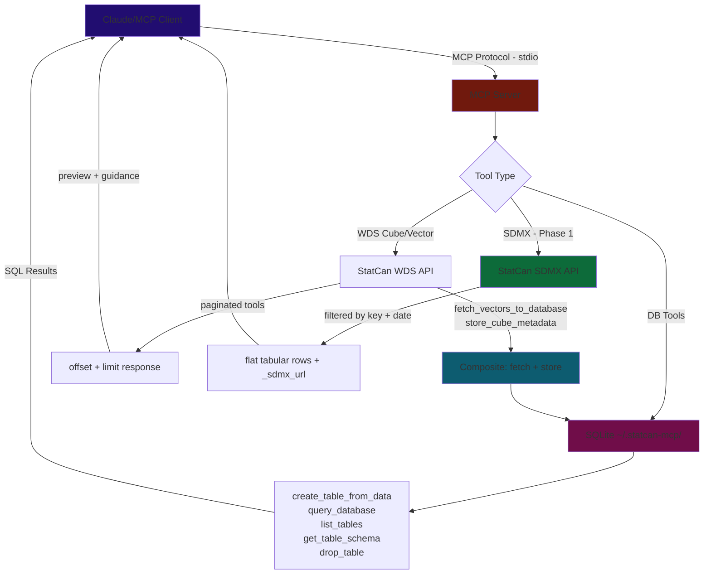
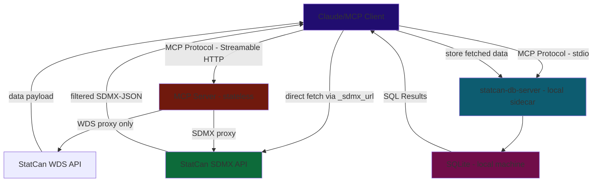

# Roadmap & Implementation Status
*Updated Feb 28, 2026*

## Up Next

### Phase 1 — SDMX Tools (`sdmx-http` branch from `main`)

#### Background: Why SDMX

The WDS API has a fundamental limitation: **no server-side dimensional filtering**. Every tool fetches a full payload and relies on post-fetch truncation. This creates unavoidable context bloat — large tool results sit in conversation history even when the LLM only needed a narrow slice.

StatCan's SDMX REST API (`https://www150.statcan.gc.ca/t1/wds/sdmx/statcan/rest/`) solves this at the source. Filtering is built into the URL path, so the response is already scoped before any bytes leave StatCan's servers.

**SDMX API reference:**
| Endpoint | URL pattern | Format |
|---|---|---|
| Data (cube) | `/data/DF_{productId}/{key}?startPeriod=...&endPeriod=...&lastNObservations=...` | JSON (explicit Accept) or XML (default) |
| Data (vector) | `/vector/v{vectorId}?startPeriod=...&endPeriod=...&lastNObservations=...` | JSON (explicit Accept) or XML (default) |
| Structure (DSD) | `/structure/Data_Structure_{productId}` | XML only (JSON returns 406) |

**Format rules (confirmed via live API testing):**
- Data + vector endpoints: use `Accept: application/vnd.sdmx.data+json;version=1.0.0-wd` → compact SDMX-JSON. Omitting Accept returns SDMX-ML Generic Data XML. CSV (`Accept: text/csv`) returns 406.
- Structure endpoint: use `Accept: application/vnd.sdmx.structure+xml;version=2.1`. JSON Accept returns 406 — XML is the only supported format.

The **key** is a dot-separated string of dimension codes. `+` for OR (`1.2+3.1`), omit for wildcard (`.1.138`). ProductId maps directly: table `17100005` → dataflow `DF_17100005`.

**Context window comparison:**
- WDS `getDataFromVectorByRange(vectorId, startDate, endDate)` → full time series → paginate after
- SDMX `/data/DF_17100005/1.2.1?lastNObservations=3` → exactly 3 observations, one series, no truncation needed

---

#### Key Concepts: Codelists, Code Sets, and DSD

Understanding the terminology is critical — SDMX "codelists" and WDS "code sets" are **different things** that serve different purposes:

**WDS `getCodeSets`** — returns **global attribute decoders**, cross-table codes for interpreting numeric values in WDS API responses:
- `scalar` — scalar factor codes (0=units, 6=millions, etc.)
- `frequency` — frequency codes (1=Daily, 6=Monthly, 12=Annual, etc.)
- `uom` — unit of measure codes (249=Persons, 308=Years, etc.)
- `status`, `symbol`, `security`, `terminated` — data quality / suppression / lifecycle markers

These do **not** contain dimension values. `getCodeSets` cannot tell you that Geography code 1 means "Canada" or that Product code 79 means "Shelter".

**SDMX Structure (DSD)** — returns **table-specific dimension codelists** embedded in the Data Structure Definition:
- `CL_Geography` — all geography codes for that table (1=Canada, 2=Newfoundland, etc.)
- `CL_Gender` — all gender codes (1=Total, 2=Men+, 3=Women+)
- `CL_Age_group` — all age group codes (1=All ages, 7=0 to 4 years, 19=10 to 14, etc.)
- Plus attribute codelists: CL_SCALAR_FACTOR, CL_STATUS_CAN, CL_UOM, CL_SYMBOL, etc.

The DSD maps each **dimension** to its codelist and specifies the dimension **position** (which position in the key string each dimension occupies):
```
DSD: Data_Structure_17100005
  pos 1: Geography -> CL_Geography (15 codes)
  pos 2: Gender -> CL_Gender (3 codes)
  pos 3: Age_group -> CL_Age_group (139 codes)
  pos 4: TIME_PERIOD (time dimension — not in key, drives observation axis)
```

**Codelists also encode hierarchy** via parent references — code 132 ("95 to 99 years") has parent 1 ("All ages"). This enables analysis at multiple granularity levels.

**Why this matters:** SDMX codelists contain **everything needed to construct a valid query key**. The LLM can call `get_sdmx_structure(17100005)` and immediately know that key `1.2.1` means Canada / Men+ / All ages — without calling any WDS metadata tools first.

**WDS memberIds = SDMX codelist codes** — same numbering, no translation needed. A member with `memberId: 2` in `getCubeMetadata` is the same as code `2` in the SDMX codelist.

---

#### Two-Pronged Strategy

**Prong 1 — WDS tools for discovery** *(existing, trimmed)*

`search_cubes`, `get_cube_metadata` (summary mode), `store_cube_metadata`, `get_series_info_from_cube_pid_coord`, `get_code_sets`. Small, context-safe responses. Used to identify what data exists and find productIds. Data-fetch tools that overlap with SDMX are **deregistered** (see migration plan below).

**Prong 2 — SDMX tools for structure + data retrieval** *(new)*

SDMX tools handle both metadata exploration (via structure/DSD) and data fetching. The structure endpoint provides richer metadata than WDS `getCubeMetadata` — full codelists with hierarchy, dimension positions, and attribute definitions — all in one call. Data endpoints return pre-filtered JSON. Every response includes `_sdmx_url` for direct client-side access.

**Example flow:**
```
[Explore]
1. search_cubes("population estimates") → find productId 17100005
2. get_sdmx_structure(17100005) → dimensions: Geography(15), Gender(3), Age_group(139) with codelist values

[Fetch]
3. get_sdmx_data(17100005, ".2.1", lastNObservations=3)
   → wildcard all geographies, Men+, All ages, last 3 years
   → 15 series × 3 obs = 45 flat rows, context-safe
   → includes _sdmx_url for direct access

[Alternative — by vector]
4. get_sdmx_vector_data(466670, lastNObservations=5)
   → 5 observations for vector 466670 (Canada / Women+ / All ages)
```

> **Note:** The existing disabled `get_full_table_download_sdmx` WDS tool returns a URL for a *full unfiltered* table dump. SDMX REST is different — dimensional filtering returns only the slice needed.

---

#### SDMX Tools to Build (priority order)

**1. `get_sdmx_structure(productId)`**

Fetches the Data Structure Definition (DSD) via XML (`/structure/Data_Structure_{productId}`). Parses codelists and dimension definitions. Returns a JSON summary:
```json
{
  "name": "Population estimates on July 1, by age and gender",
  "productId": 17100005,
  "dimensions": [
    {"id": "Geography", "position": 1, "codelist": "CL_Geography", "codes": [
      {"id": "1", "name": "Canada"},
      {"id": "2", "name": "Newfoundland and Labrador", "parent": "1"},
      ...
    ], "_code_count": 15, "_truncated": false},
    {"id": "Gender", "position": 2, "codelist": "CL_Gender", "codes": [...], "_code_count": 3},
    {"id": "Age_group", "position": 3, "codelist": "CL_Age_group", "codes": [...first 10...],
     "_code_count": 139, "_truncated": true, "_message": "Showing first 10 of 139 codes. Use + for OR or omit for wildcard in key at position 3."}
  ],
  "_sdmx_url": "https://..."
}
```
Apply member truncation (`DEFAULT_MEMBER_LIMIT = 10` from `truncation.py`) for large codelists. Include `_sdmx_url` pointing to the full structure endpoint.

**2. `get_sdmx_data(productId, key, startPeriod?, endPeriod?, lastNObservations?)`**

The core data-fetch tool. The `key` uses SDMX syntax directly — dot-separated dimension codes in position order as defined by the DSD. Fetches SDMX-JSON via explicit Accept header, dereferences the index-based format using `flatten_sdmx_json()` into flat tabular rows (one dict per observation). Apply `MAX_SDMX_ROWS = 500` safety cap. Include `_sdmx_url`.

Key syntax: `1.2.1` (Geography=Canada, Gender=Men+, Age_group=All ages). `+` for OR (`1.2+3.1`), omit value for wildcard (`.2.1` = all geographies). Supports `lastNObservations` and `startPeriod`/`endPeriod` (`YYYY` or `YYYY-MM` format).

**3. `get_sdmx_vector_data(vectorId, startPeriod?, endPeriod?, lastNObservations?)`**

Fetches a single time series by stable vectorId via SDMX JSON. Simpler than the cube endpoint — no key construction needed. Supports `lastNObservations`. Same `flatten_sdmx_json()` flattening as `get_sdmx_data`. Include `_sdmx_url`.

**4. `build_sdmx_url(productId, key?, vectorId?, startPeriod?, endPeriod?, lastNObservations?)` *(optional)*

Pure URL construction — no fetch. Returns the constructed SDMX URL as a string. Useful for clients that want to fetch directly or embed in Python/Jupyter code. Could also be exposed as an MCP Prompt template instead of a tool.

---

#### WDS Tool Deregistration Plan

Three WDS data-fetch tools become redundant once SDMX tools exist. They fetch full payloads and truncate client-side — SDMX does the same job with server-side filtering:

| WDS Tool to Deregister | SDMX Replacement | Why |
|---|---|---|
| `get_data_from_cube_pid_coord_and_latest_n_periods` | `get_sdmx_data(pid, key, lastNObservations=N)` | SDMX filters at source; WDS fetches full payload then truncates |
| `get_data_from_vectors_and_latest_n_periods` | `get_sdmx_vector_data(vectorId, lastNObservations=N)` | Same — SDMX returns only requested observations |
| `get_data_from_vector_by_reference_period_range` | `get_sdmx_data` or `get_sdmx_vector_data` with `startPeriod`/`endPeriod` | SDMX supports date range filtering natively |

**Tools to keep (no SDMX equivalent):**
| WDS Tool | Why Keep |
|---|---|
| `search_cubes_by_title` | Discovery — no SDMX search endpoint |
| `get_all_cubes_list` / `get_all_cubes_list_lite` | Browsing — SDMX has no list-all endpoint |
| `get_cube_metadata` / `store_cube_metadata` | WDS metadata format is still useful alongside SDMX structure |
| `get_series_info_from_cube_pid_coord` / `_bulk` | Resolves coordinates → vectorIds, frequency, units |
| `get_code_sets` | Decodes WDS response attribute codes (scalar, frequency, UoM) |
| `get_bulk_vector_data_by_range` | Release-date filtering is WDS-only (SDMX only supports reference period) |
| `get_changed_series_data_from_cube_pid_coord` | Change detection — WDS-only |
| `get_changed_series_data_from_vector` | Change detection — WDS-only |
| `get_changed_cube_list` / `get_changed_series_list` | Change detection — WDS-only |
| All DB tools + composite tools | Local storage layer — orthogonal to API choice |

---

#### Implementation Notes — Confirmed via Live API Testing

**Response format: JSON for data endpoints (explicit Accept), XML for structure (only option).**

Data endpoints (both cube and vector) support SDMX-JSON via:
```
Accept: application/vnd.sdmx.data+json;version=1.0.0-wd
```
This returns valid JSON. Omitting the Accept header returns SDMX-ML Generic Data XML instead. CSV (`Accept: text/csv`) returns 406 — not supported by StatCan's implementation. Structure endpoint only supports XML — JSON returns 406, no workaround.

**SDMX-JSON response format (index-based compact encoding):**

The JSON format uses positional indices to minimize payload size. Requires dereferencing against the `structure` metadata:

```json
{
  "dataSets": [{
    "series": {
      "0.0.0": {
        "attributes": [0, 0],
        "observations": {
          "0": ["20810309", 0, 0, 0, null, null, null, null]
        }
      }
    }
  }],
  "structure": {
    "dimensions": {
      "series": [
        {"id": "Geography", "values": [{"id": "1", "name": "Canada"}]},
        {"id": "Gender", "values": [{"id": "2", "name": "Men+"}]},
        {"id": "Age_group", "values": [{"id": "1", "name": "All ages"}]}
      ],
      "observation": [
        {"id": "TIME_PERIOD", "values": [{"id": "2025", "name": "2025"}]}
      ]
    },
    "attributes": {
      "series": [{"id": "DGUID", "values": [...]}, {"id": "UOM", "values": [...]}],
      "observation": [
        {"id": "SCALAR_FACTOR", "values": [...]},
        {"id": "VECTOR_ID", "values": [{"id": "466669", "name": "466669"}]},
        ...
      ]
    }
  }
}
```

**Decoding rules:**
- Series key `"0.0.0"` = indices into `structure.dimensions.series[n].values[idx]`:
  - `0` → Geography.values[0] = Canada (id="1")
  - `0` → Gender.values[0] = Men+ (id="2")
  - `0` → Age_group.values[0] = All ages (id="1")
- Observation key `"0"` = index into `structure.dimensions.observation[0].values[0]` = 2025
  - **Use `id` field (not `name`) for the time period string** — both are "2025" for annual, but "2023-01" format is only in `id` for monthly
- Observation value array: `[dataValue, attr0_idx, attr1_idx, ...]` — each `attr_idx` indexes into `structure.attributes.observation[n].values[idx]`. `null` = attribute not applicable.
- Series attributes array: same pattern, indexing into `structure.attributes.series[n].values[idx]`
- VECTOR_ID is an **observation-level** attribute (not series-level)
- Out-of-range or null indices should be silently skipped (StatCan sometimes omits trailing nulls)

**Flattening to tabular rows** — `src/util/sdmx_json.py` `flatten_sdmx_json()` produces:
```json
[{
  "Geography": "Canada",
  "Gender": "Men+",
  "Age_group": "All ages",
  "period": "2025",
  "value": "20810309",
  "SCALAR_FACTOR": "units",
  "VECTOR_ID": "466669",
  "UOM": "Persons"
}]
```
Observation-level attributes take priority over series-level on name collision. Attribute keys use raw SDMX IDs (UPPERCASE) — no transformation.

**WDS coordinate → SDMX key:** WDS memberIds and SDMX codelist codes use the same numbering. Strip trailing `.0` segments from the WDS coordinate string to get the SDMX key:
- `"1.2.1.0.0.0.0.0.0.0"` → `"1.2.1"` (Canada / Men+ / All ages)
- `"2.2.0.0.0.0.0.0.0.0"` → `"2.2"`

**`lastNObservations` works on both endpoints** (data cube and vector). `startPeriod`/`endPeriod` work on both. Dates as `YYYY` (annual) or `YYYY-MM` (monthly). `firstNObservations` is also supported.

**SSL must be skipped** (`verify=False` in httpx — already set in `config.py`).

**Wildcard queries** work — key `.2.1` (omit Geography) returns all 15 geographies for Men+ / All ages. This is a major advantage over WDS which has no wildcard capability.

**Structure endpoint XML parse notes:**

SDMX 2.1 namespaces (use Clark notation in ElementTree):
```python
NS = {
    "mes": "http://www.sdmx.org/resources/sdmxml/schemas/v2_1/message",
    "str": "http://www.sdmx.org/resources/sdmxml/schemas/v2_1/structure",
    "com": "http://www.sdmx.org/resources/sdmxml/schemas/v2_1/common",
}
XML_LANG = "{http://www.w3.org/XML/1998/namespace}lang"
```

`xml:lang` attribute is not supported in ElementTree XPath — use Clark notation `{http://www.w3.org/XML/1998/namespace}lang` to filter English names. Fallback: take the first `com:Name` if no English-tagged one is found.

`Ref` elements (inside `str:Enumeration` and `str:Parent`) may be in no namespace or common namespace — search by tag suffix: `child.tag == "Ref" or child.tag.endswith("}Ref")`.

XML structure to parse:
```xml
<str:Codelist id="CL_Geography">
  <com:Name xml:lang="en">Geography</com:Name>
  <str:Code id="1"><com:Name xml:lang="en">Canada</com:Name></str:Code>
  <str:Code id="2"><com:Name xml:lang="en">Newfoundland and Labrador</com:Name>
    <str:Parent><Ref id="1"/></str:Parent>
  </str:Code>
</str:Codelist>

<str:DataStructure id="Data_Structure_17100005">
  <com:Name xml:lang="en">Population estimates on July 1, by age and gender</com:Name>
  <str:DataStructureComponents>
    <str:DimensionList>
      <str:Dimension id="Geography" position="1">
        <str:LocalRepresentation>
          <str:Enumeration><Ref id="CL_Geography"/></str:Enumeration>
        </str:LocalRepresentation>
      </str:Dimension>
      <str:TimeDimension id="TIME_PERIOD" position="4"> ... </str:TimeDimension>
    </str:DimensionList>
  </str:DataStructureComponents>
</str:DataStructure>
```

`TIME_PERIOD` is a `str:TimeDimension` (not `str:Dimension`) — skip it from the codelist-backed dimensions list since it has no codelist (it drives the observation axis, not the series key).

**httpx for SDMX requests** — use inline `httpx.AsyncClient` with full URL (not `base_url`) since SDMX_BASE_URL differs from WDS BASE_URL. Pass `verify=False` and the appropriate Accept header explicitly.

**New files:** `src/api/sdmx_tools.py`, `src/models/sdmx_models.py`, `src/util/sdmx_json.py` (done). Use inline `httpx.AsyncClient` with SDMX_BASE_URL from config. Register via existing `ToolRegistry` — no new infrastructure needed.

---

#### Phase 1 Progress

- [x] Add SDMX constants to `config.py` — `SDMX_BASE_URL`, `SDMX_JSON_ACCEPT`, `SDMX_XML_ACCEPT`, `MAX_SDMX_ROWS`
- [x] `src/util/sdmx_json.py` — `flatten_sdmx_json(data)` SDMX-JSON → tabular rows
- [x] `src/models/sdmx_models.py` — `SDMXStructureInput`, `SDMXDataInput`, `SDMXVectorInput`
- [x] `src/api/sdmx_tools.py` — `register_sdmx_tools(registry)` with 3 tools
- [x] Wire `register_sdmx_tools` into `server.py`
- [x] `get_sdmx_structure(productId)` — XML parse → JSON summary with codelist truncation
- [x] `get_sdmx_data(productId, key, startPeriod?, endPeriod?, lastNObservations?)` — JSON fetch + flatten
- [x] `get_sdmx_vector_data(vectorId, startPeriod?, endPeriod?, lastNObservations?)` — JSON fetch + flatten
- [x] Deregister `get_data_from_cube_pid_coord_and_latest_n_periods` (comment out `@registry.tool()` in `cube_tools.py`)
- [x] Deregister `get_data_from_vectors_and_latest_n_periods` (comment out `@registry.tool()` in `vector_tools.py`)
- [x] Deregister `get_data_from_vector_by_reference_period_range` (comment out `@registry.tool()` in `vector_tools.py`)
- [ ] `build_sdmx_url(...)` *(optional, or MCP Prompt)*

---

### Phase 1 — Post-Implementation Bug Investigations *(found in stress testing, Feb 28, 2026)*

Three bugs found during stress testing. Two have confirmed root causes; one needs live investigation.

---

#### Bug 1 — Wrong `period` values for sub-annual frequencies (CONFIRMED, fix known)

**Symptom:** For a monthly table (`14100287`), `get_sdmx_data` and `get_sdmx_vector_data` return `period: "2026"` (annual year) for all observations instead of `"2025-11"`, `"2025-12"`, `"2026-01"`. Multiple distinct months become indistinguishable — every row says `"2026"`.

**Root cause (confirmed via live inspection):** StatCan's SDMX API sets the `id` field in `structure.dimensions.observation[0].values` to the calendar year only, even for monthly data:

```json
{
  "start": "2025-11-01T00:00:00",
  "end":   "2026-10-31T23:59:59",
  "id":    "2026",
  "name":  "2026"
}
```

The correct period is derivable from `start`: `"2025-11"`. Our `flatten_sdmx_json` uses `entry.get("id")` which gives the wrong bare-year string.

**Fix (in `src/util/sdmx_json.py`):**
In the TIME_PERIOD section of `flatten_sdmx_json`, prefer `start[:7]` (YYYY-MM) when `id` is a bare 4-digit year and `start` is available:

```python
entry = period_vals[obs_idx]
period_id = entry.get("id", "")
start_dt = entry.get("start", "")
# StatCan sets id to bare year even for monthly data; start has the real period
if start_dt and len(period_id) == 4 and period_id.isdigit():
    row["period"] = start_dt[:7]  # "2025-11-01T..." → "2025-11"
else:
    row["period"] = period_id or entry.get("name")
```

For annual tables this gives `"YYYY-01"` — more precise than `"YYYY"` but unambiguous.
For monthly tables this gives `"YYYY-MM"` — correct.

- [ ] Apply fix in `src/util/sdmx_json.py`
- [ ] Add unit test: mock response with `start` fields, assert `period` is YYYY-MM

---

#### Bug 2 — `lastNObservations` + `startPeriod`/`endPeriod` combined → 406 (CONFIRMED, API limitation)

**Symptom:**
```
Error: 406 for url '.../data/DF_14100287/6+7+10.7.1.1.1.1?lastNObservations=24&startPeriod=2024-01&endPeriod=2026-01'
```

Without `lastNObservations`, the same key with `startPeriod`/`endPeriod` returns 200 and data. With `lastNObservations` alone, also 200.

**Root cause:** StatCan's SDMX REST implementation rejects requests that combine `lastNObservations` with `startPeriod` or `endPeriod`. This is not in the SDMX spec but is a known StatCan API constraint.

**Fix (in `src/api/sdmx_tools.py`):**
Add early validation in both `get_sdmx_data` and `get_sdmx_vector_data`:

```python
if data_input.lastNObservations is not None and (data_input.startPeriod or data_input.endPeriod):
    raise ValueError(
        "StatCan SDMX does not support combining lastNObservations with startPeriod/endPeriod. "
        "Use one or the other: lastNObservations=N for recent data, "
        "or startPeriod/endPeriod for a date range."
    )
```

Also update docstrings to document this constraint explicitly.

- [ ] Add validation in `get_sdmx_data`
- [ ] Add validation in `get_sdmx_vector_data`
- [ ] Update docstrings with explicit constraint note

---

#### Bug 3 — Missing `Geography` and `period` in some rows for OR-key queries (NEEDS INVESTIGATION)

**Symptom:** Key `6+7+10.7.1.1.1.1` (Quebec + Ontario + Alberta, `startPeriod`/`endPeriod`) returns 75 rows. Most rows show `Geography: "Quebec"` correctly. But a subset of rows has no `Geography` field, no `Data_type` field, and no `period` field — only `Labour_force_characteristics`, `Gender`, `Age_group`, `Statistics`, `value`, `SCALAR_FACTOR`, `DGUID`. These phantom rows confuse the LLM into citing incorrect provincial data.

**Hypothesis 1:** The SDMX response `structure.dimensions.observation[0].values` list is too short for some series — observation index overflows and `period` silently drops. This could happen if different series (Ontario, Alberta) have a different number of available observations within the requested period range.

**Hypothesis 2:** The API returns additional unlisted series for OR-key queries (e.g., a `Trend-cycle` variant) where the series key has fewer dimensions, causing `Geography` to be decoded at the wrong dim index.

**Hypothesis 3:** The `startPeriod`/`endPeriod` filter is not applied per-series — the combined observation dimension values list from multi-series is longer than expected, and the flattener decodes periods correctly for some series but `obs_idx` overflows `period_vals` for others (period silently drops per the `if obs_idx < len(period_vals)` guard).

**Investigation needed:**
1. Fetch `data/DF_14100287/6+7+10.7.1.1.1.1?startPeriod=2024-01&endPeriod=2026-01` raw JSON
2. Inspect `structure.dimensions.series[0].values` — does it contain all 3 geographies?
3. Inspect `structure.dimensions.observation[0].values` — how many entries? Are they all monthly (YYYY-MM in `start`)?
4. Check series keys — do all series have 6-part keys? Any with 5 or fewer parts (indicating a missing dimension)?
5. Cross-check: `max(obs_idx for each series)` vs `len(observation values)` — is there overflow?

**Workaround until fixed:** Use separate `get_sdmx_data` calls per geography instead of OR syntax. Document in tool docstring.

- [ ] Run investigation (fetch raw SDMX JSON and inspect structure for OR query)
- [ ] Determine root cause: overflow, phantom series, or API bug
- [ ] Fix in `flatten_sdmx_json` (guard against overflow) or `sdmx_tools.py` (validate response before flattening)
- [ ] Update docstring with OR-key limitations

---

### Phase 2 — HTTP Transport (`sdmx-http` branch, after SDMX tools are stable)

#### Approach

Do **not** merge the stale `http` branch — it uses FastMCP which is unnecessary. The standard `mcp` SDK (>=1.3.0, already a dependency) supports Streamable HTTP transport. Build HTTP support directly on the existing `server.py` + `ToolRegistry` pattern.

**Stateless server architecture:**
- Server is a pure API proxy — fetches StatCan/SDMX data and returns it, stores nothing server-side
- DB tools excluded from HTTP mode (no per-user storage)
- Each client manages its own local SQLite via a separate `statcan-db-server` stdio sidecar (optional)
- SDMX tools are especially well-suited for HTTP mode — filtered responses, no storage needed
- Unlocks hosting on Render, Railway, Cloudflare Workers

**Implementation:**
- Add `--transport [stdio|http]` CLI flag to `server.py`
- In HTTP mode: skip `register_composite_tools` and `register_db_tools`
- Configure host/port via env vars or CLI args
- Auth: evaluate OAuth vs API key based on Python SDK support at implementation time

- [ ] Add `--transport` CLI flag; wire Streamable HTTP transport from `mcp` SDK
- [ ] Exclude DB/composite tools in HTTP mode
- [ ] Deploy to Render/Railway as a public free-tier instance
- [ ] Audit `fetch_vectors_to_database` and `store_cube_metadata` — provide pure-return variants for HTTP mode

---

### Phase 3 — MCP Resources & Prompts for SDMX *(after HTTP is stable)*

Expose SDMX URL construction as MCP primitives — supplementary to the SDMX tools, not a replacement.

- **Resource template:** `sdmx://statcan/data/{productId}/{key}` → resolves to the constructed SDMX URL and usage instructions
- **Prompt:** "SDMX data analysis" → reusable template with step-by-step URL construction guide, format notes, and `sdmx1`/`pandas` Python usage examples

These are additive — registered alongside tools in `create_server()`, no architectural change needed.

- [ ] Add `server.list_resources()` / `server.read_resource()` handlers
- [ ] Add `server.list_prompts()` / `server.get_prompt()` handlers
- [ ] SDMX URL construction prompt with Python usage examples

---

### Phase 4 — MCP Apps / Data Visualization *(post-HTTP, post-Python SDK support)*

Return interactive HTML charts/dashboards in-chat via `ui://` resources.

**No overhaul required.** MCP Apps are an additive primitive — registered alongside existing tools via a new handler, not a replacement for the existing architecture. The `ToolRegistry` pattern, all WDS tools, SDMX tools, and DB tools remain unchanged. Apps would be a new module (`src/api/app_tools.py`) registered in `create_server()` the same way as `register_cube_tools(registry)`.

**Architecture clarification — where visualization tools live:**

`visualize_table` queries *local* SQLite. This creates a hard split between the two server modes:

- **Local stdio server** — has SQLite. Visualization tools register here alongside DB tools. Works naturally.
- **Remote HTTP server** — stateless, no SQLite. Visualization tools are *excluded* from the HTTP build. Users who want charts use the local `statcan-db-server` stdio sidecar, where both DB tools and visualization tools live.

This is consistent with the existing DB split: remote HTTP server = API proxy only, local stdio sidecar = DB layer + everything that depends on it. Visualization is part of the DB layer, not the API layer.

**Current blockers:**
- Python MCP SDK does not yet support MCP Apps (JS SDK only, as of Feb 2026)
- Requires HTTP transport (stdio cannot serve HTML resources back to client)
- Limited host support — few MCP clients render `ui://` resources

**Unblocked when:** Phase 2 (HTTP transport) is live + Python SDK ships MCP Apps support.

---

## Context Window / Chat Memory — Design Principles

The core tension: tool results must be in context for the LLM to reason about them, but context is finite, expensive, and accumulates silently across a session. Large tool results don't disappear — they sit in conversation history and inflate the cost of every subsequent API call.

**Three-layer defense:**

1. **Precision fetching at source (SDMX)** — dimensional filtering in the URL means smaller responses before any truncation. `lastNObservations=12` limits to one year of monthly data. `/data/DF_18100004/1.2.7.0.0.0.0.0.0.0` fetches one series, not a whole table.

2. **Summary-first pattern (existing + SDMX)** — return stats/schema by default, full data only on explicit request. `get_sdmx_structure` returns the schema without any observations. `get_cube_metadata(summary=True)` caps member lists.

3. **URL passthrough** — every SDMX tool response includes `_sdmx_url`. Clients with execution environments (Claude Code, Claude.ai analysis sandbox) can fetch outside the MCP context entirely — data never enters conversation history. Claude Desktop users without a sandbox fall back to tool-mediated fetching with truncation.

**How Claude.ai handles overflow (observed):**
When a tool result exceeds context limits, Claude.ai stores it at `/mnt/user-data/tool_results/statcan_{tool}_{id}.json` and returns a path. The file format is `[{"text": "<json-string>"}]` — requiring double-parse. The LLM then uses Python scripts in the analysis sandbox to navigate the file. This works but costs ~6 extra tool calls and significant reasoning overhead. The `store_cube_metadata` → `query_database` pattern avoids this by keeping the data in SQLite from the start.

---

## Quality

- [ ] **Enable SSL verification** — `VERIFY_SSL = False` is a security risk
- [ ] **CI/CD linting** — ruff + mypy on push/PR
- [ ] **Expand tests** — mock StatCan API responses; per-tool coverage (currently only truncation is tested)
- [ ] **Consolidate HTTP client usage** — most tools create inline `httpx.AsyncClient` instead of using shared `api/client.py` helpers

---

## Distribution

- [ ] **Register on Smithery.ai** — one-click install button
- [ ] **Submit to directories** — `punkpeye/awesome-mcp-servers`, PulseMCP
- [ ] **Multi-client config snippets** — Cursor, VS Code Copilot, Windsurf in README
- [ ] **Windows setup guide** — needs testing on Windows VM first
- [ ] **Dockerfile** — for Docker MCP Catalog listing

---

## Future / Exploratory

- [ ] **A2A + MCP** — multi-agent system exploration
- [ ] **Scheduled reports** — periodic LLM calls for dataset summaries
- [ ] **Caching aligned to StatCan update schedule** — time-based invalidation at StatCan's 8:30 AM ET release cadence
- [ ] **Full cube pre-fetch** — download all cube metadata to local DB for fully offline browsing (low priority; current search + on-demand fetch is sufficient)

---

## Architecture & Data Flow

### Current (stdio / local)



### Target (HTTP / stateless remote)



---

## Completed

### Phase 1 Complete — SDMX Tools *(Feb 28, 2026)*

- [x] `SDMX_BASE_URL`, `SDMX_JSON_ACCEPT`, `SDMX_XML_ACCEPT`, `MAX_SDMX_ROWS` added to `config.py`
- [x] `src/util/sdmx_json.py` — `flatten_sdmx_json(data)`: dereferences SDMX-JSON compact indices into tabular rows. Handles series dims, obs dims, series attrs, obs attrs. Uses `_deref()` helper for safe index lookup. Obs-level attributes take priority over series-level on name collision.
- [x] `src/models/sdmx_models.py` — `SDMXStructureInput`, `SDMXDataInput` (productId, key, startPeriod, endPeriod, lastNObservations), `SDMXVectorInput` (vectorId, startPeriod, endPeriod, lastNObservations)
- [x] `src/api/sdmx_tools.py` — `register_sdmx_tools(registry)` with 3 tools: `get_sdmx_structure`, `get_sdmx_data`, `get_sdmx_vector_data`. XML parsing via ElementTree with SDMX 2.1 namespaces and Clark-notation `xml:lang` handling. Codelist truncation at `DEFAULT_MEMBER_LIMIT=10`. MAX_SDMX_ROWS=500 cap on flattened rows. `_sdmx_url` included in all responses.
- [x] `server.py` — `register_sdmx_tools` wired in
- [x] 3 WDS data-fetch tools deregistered (`@registry.tool()` commented out, functions kept): `get_data_from_cube_pid_coord_and_latest_n_periods`, `get_data_from_vectors_and_latest_n_periods`, `get_data_from_vector_by_reference_period_range`

### Metadata Navigation Guidance — v0.2.1 *(Feb 26, 2026)*

**Problem observed:** An LLM session attempting to build a CPI + Labour Force dashboard hit a cascade of failures caused by metadata truncation and misleading guidance:

1. `summary=True` showed only 5 members per dimension — critical members like "Unemployment" (member 6) and "Unemployment rate" (member 7) were hidden. The LLM spent pages of reasoning guessing what coordinate positions meant.
2. `summary=False` produced 285KB of JSON — overflowed the context window. The client stored it to a file, forcing the LLM to install `jq` and write Python scripts to parse JSON-within-JSON (`data[0]['text']`).
3. The `_message` guidance said "get all members and their **vectorIds**" — but `getCubeMetadata` **does not return vectorIds** in member objects. VectorIds only come from `get_series_info_from_cube_pid_coord`. The LLM followed dead-end advice.
4. `_note` (top-level) and `_message` (per-dimension) were redundant, both saying "call with summary=False".
5. No guidance explained the coordinate-to-memberId mapping, so the LLM couldn't reason about which coordinate positions to use.

**Fixes applied:**
- [x] **`DEFAULT_MEMBER_LIMIT` 5 → 10** — shows more members before truncation
- [x] **Removed `_note`** — redundant with per-dimension `_message`
- [x] **Rewrote `_message` with actionable guidance** — explains coordinate position mapping, directs to `store_cube_metadata` and `get_series_info_from_cube_pid_coord`. Removed false vectorId claim.

**Key learning:** `getCubeMetadata` returns member names and hierarchy but **not vectorIds**. The three paths to vectorIds are:
1. `get_series_info_from_cube_pid_coord(productId, coordinate)` — resolve one coordinate at a time
2. `get_series_info_from_cube_pid_coord_bulk(items)` — resolve many coordinates in one call
3. `store_cube_metadata(productId)` → `query_database` — browse all members via SQL

### Context Window Overflow — v0.2.0 *(Feb 26, 2026)*
- [x] **`summarize_cube_metadata` default reduced 20 → 5** — `DEFAULT_MEMBER_LIMIT = 5` in `src/util/truncation.py`; 2 new tests added (15 total)
- [x] **Footnote stripping in summary mode** — replaces full `footnote` array with a count string
- [x] **`store_cube_metadata(pid)` composite tool** — fetches full metadata, stores into `_statcan_dimensions` + `_statcan_members`; returns compact summary only
- [x] **`get_cube_metadata` docstring updated** — points LLMs to `store_cube_metadata` for full member browsing without context cost

### Context Overflow & Truncation *(Feb 25, 2026)*
- [x] **Shared truncation utility** — `src/util/truncation.py`: `truncate_response`, `truncate_with_guidance`, `summarize_cube_metadata`; 13 unit tests
- [x] **`get_cube_metadata` summary mode** — `summary=True` (default) caps member lists; `summary=False` returns full response
- [x] **Cube list pagination** — `get_all_cubes_list` / `get_all_cubes_list_lite` paginated via `CubeListInput(offset, limit=100)`
- [x] **Search result cap** — `search_cubes_by_title` capped at `max_results=25`
- [x] **Bulk coord truncation + guidance** — `get_series_info_from_cube_pid_coord_bulk` paginates + injects `_guidance`
- [x] **Research: cursor-based pagination** — concluded it doesn't solve the problem; context overflow is caused by data accumulating in the window, not pagination inconsistency. Store-then-query is the correct direction.

### High-Priority Fixes *(Feb 25, 2026)*
- [x] **Bump `mcp>=1.3.0,<2`** — fixes protocol version mismatch; unlocks concurrent requests, Lifespan API, server `instructions` field
- [x] **Smart truncation for vector tools** — replaced auto-store with offset/limit pagination
- [x] **Bulk coord tool** — `get_series_info_from_cube_pid_coord_bulk` eliminates N sequential HTTP calls
- [x] **Registry `$defs` support** — `ToolRegistry` includes `$defs` in inputSchema for nested Pydantic models
- [x] **DB path fix** — `config.py` uses `pwd.getpwuid(os.getuid()).pw_dir`; `--db-path` CLI flag

### Core Data-Fetching Fixes *(Feb 25, 2026)*
- [x] `create_table_from_data` creates schema + inserts rows in one call
- [x] `fetch_vectors_to_database` composite tool — fetch + store in SQLite in a single call
- [x] Rewrote tool docstrings with workflow hints steering LLMs toward bulk vector pattern
- [x] Stable DB path at `~/.statcan-mcp/statcan_data.db`

### Distribution & Publishing *(Feb 23, 2026)*
- [x] PyPI — `pip install statcan-mcp-server` / `uvx statcan-mcp-server`; Trusted Publishing via GitHub OIDC
- [x] MCP Registry — `io.github.Aryan-Jhaveri/mcp-statcan`
- [x] GitHub Actions CI/CD — auto-publishes on push to `main`
- [x] Full StatCan WDS API coverage (~15 tools)
- [x] In-memory TTL cache for `search_cubes_by_title`
- [x] SQLite database layer — create, insert, query, list, schema, drop tools
- [x] `query_database` hardened — `PRAGMA query_only = ON` enforces read-only at SQLite engine level

---
