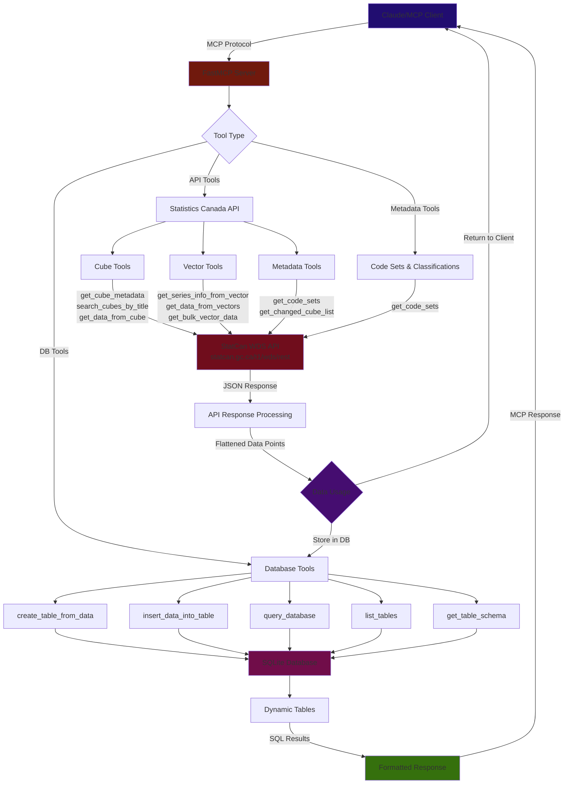

# IMPLEMENTATIONS.MD

# 🗺️ Roadmap & Ecosystem Alignment
*Updated Feb 2026 — informed by MCP Apps, Registry, and ecosystem best practices research*

## Tier 1: Foundational Fixes (Weekend Project)

- [x] **Create `pyproject.toml`** — Proper Python packaging with hatchling build backend, project metadata, dependencies, and console entry point (`statcan-mcp-server`). *(Completed)*
- [ ] **Enable SSL verification** — SSL is currently disabled for development. Fix httpx SSL settings and document any proxy/corporate certificate workarounds.
- [ ] **Harden SQL input validation** — Database tools accept raw SQL with "basic" validation. Implement: whitelist of allowed SQL operations (SELECT only), parameterized queries to prevent injection, and query size/timeout limits.
- [ ] **Add a uv or smithery package installer** — Install packages to Claude or other LLM clients directly instead of having to adjust working directories *(carried from June 1, 2025)*

## Tier 2: Ecosystem Integration (One-Week Sprint)

- [x] **Publish to PyPI** — Automated via GitHub Actions on tag push. Package: `statcan-mcp-server`. Install: `pip install statcan-mcp-server` / `uvx statcan-mcp-server`. Uses Trusted Publishing (OIDC). *(Completed Feb 23, 2026)*
- [x] **Register on Official MCP Registry** — `server.json` created and validated against schema. Registered as `io.github.aryan-jhaveri/mcp-statcan`. Automated publishing via `mcp-publisher` CLI with GitHub OIDC auth on tag push. *(Completed Feb 23, 2026)*
- [ ] **Submit to remaining directories** — PR to `punkpeye/awesome-mcp-servers` (syncs to Glama), register on Smithery.ai, submit to PulseMCP (`pulsemcp.com/submit`), consider Docker MCP Catalog.
- [x] **Add GitHub Actions CI/CD (release workflow)** — Publishes to PyPI and MCP Registry on tagged releases via `.github/workflows/publish-mcp-registry.yml`. Uses GitHub OIDC for both PyPI Trusted Publishing and MCP Registry auth. *(Completed Feb 23, 2026)*
- [ ] **Expand CI/CD with linting and type checking** — Add ruff, mypy, and tests on every push/PR. (DONT DO THIS YET - Because I need to polish up on CI/CD)
- [ ] **Create a Dockerfile** — Slim Python base image for sandboxed deployment. Enables Docker MCP Catalog listing. (DONT DO THIS YET - Because I need to polish up on Docker)
- [ ] **Create setup/installation guides for Windows** *(carried from June 1, 2025)* (DONT DO THIS YET - Because I need to test on windows virtual machine)

## Tier 3: Quality & Completeness (Two-Week Sprint)

- [ ] **Write tests** — Unit tests per tool function (pytest), mock StatCan API responses. Integration tests via FastMCP in-memory client. Test edge cases: empty results, API timeouts, malformed responses, pagination boundaries. Measure **tool hit rate** (LLM correctly picks right tool for 20 natural-language queries). (Need to research and plan)

- [ ] **Complete StatCan WDS API coverage** — The Web Data Service provides **15 methods**; implement all of them. Missing ones likely include `getAllCubesListLite`, `getCubeMetadata`, `getBulkVectorDataByRange`, `getChangedCubeList`, `getChangedSeriesDataFromVector`, etc. Each tool needs clear name, detailed description (explain StatCan "cubes" and "vectors" for LLMs), and well-defined input schema.
(There's trade offs between wds and sdmx tools, currently the LLM are fetching and readon one data point at a time maybe )

- [ ] **Add MCP Resources & Prompts** — Currently only exposes tools. Add **resources** for: available StatCan subject categories, StatCan data model explainer (cubes, vectors, coordinates, reference periods), API rate limits/constraints. Add **prompt templates** for: "Find and analyze a StatCan time series", "Compare regional statistics across provinces", "Get the latest economic indicators".
(Need subject matter experts to review)

- [ ] **Implement cursor-based pagination** — For tools returning large result sets, implement the MCP spec's pagination pattern with opaque cursor tokens and server-determined page sizes. Prevents timeouts on large queries.
(Need to research and plan and underdstand pagination and cursor tokens)

- [ ] Fix `get_bulk_vector` truncated output exceeding LLM context — better implementation: read heads of fetched data, or always route through db tools *(carried from Jan 7, 2026)*

- [ ] Fix `create_table_from_data` not filling DB — LLM needs additional tool call to manually insert data, causes errors and context token exhaustion *(carried from Jan 7, 2026)*

## Tier 4: Differentiation (Month-Long Effort)

- [ ] **Add MCP Apps support for data visualization** — Declare `ui://` resources that render interactive charts/tables. Time series → interactive Chart.js/Plotly chart in sandboxed iframe. Data tables → sortable/filterable HTML table. Use `ext-apps` SDK (`add-app-to-server` agent skill). Text fallback for non-supporting clients. Would make mcp-statcan one of the few data MCP servers with visual output.

- [ ] **Support Streamable HTTP transport** — Add HTTP server mode alongside stdio for remote deployment. Unlocks hosting on Cloudflare Workers, Render, Railway. Consider deploying a free public instance for zero-setup access.

- [ ] **Add structured output schemas** — Define typed output schemas for each tool's response, enabling downstream tools and MCP Apps UIs to parse results programmatically.
- [ ] **Implement caching** — StatCan data updates at 8:30 AM ET on business days. Cache API responses with time-based invalidation aligned to this schedule. Reduces StatCan API load, improves response times.

- [ ] **Look into SDMX implementation** — Allow Claude to create files or exact URIs for vector and metadata fetching; mix of REST and SDMX tools available *(carried from Jan 7, 2026)*

- [ ] **Maybe: Look into A2A + MCP** — (https://arxiv.org/pdf/2506.01804) to create an extended multi-agent system *(carried from June 3, 2025, only for curiosity)*

## Documentation Improvements

- [ ] **Badges section** — PyPI version, CI status, license, MCP registry link
- [ ] **Tool reference table** — Every tool with parameters, return types, example usage
- [ ] **CONTRIBUTING.md** with contribution guidelines
- [ ] **CHANGELOG.md** tracking versions
- [ ] **Multi-client config examples** — Claude Desktop, Claude Code, Cursor, VS Code Copilot, Windsurf (not just Claude Desktop)
- [ ] **StatCan explainer section** — What StatCan data is and why it's useful, for international users

---

# 📓 Development Log

## February 23, 2026 — PyPI & MCP Registry Publishing

[x] Created `server.json` validated against MCP Registry JSON schema (`io.github.aryan-jhaveri/mcp-statcan`).

[x] Added GitHub Actions workflow (`.github/workflows/publish-mcp-registry.yml`) for automated PyPI + MCP Registry publishing on `v*` tag push.

[x] Configured PyPI Trusted Publishing (OIDC) — no API tokens needed.

[x] Added `mcp-name` ownership verification marker to README.md.

[x] Enabled console script entry point (`statcan-mcp-server`) in `pyproject.toml`.

[x] Added sync `main()` wrapper in `server.py` for entry point compatibility (async logic preserved in `_async_main()`).

[x] Tagged `v0.1.1` and pushed to trigger first automated release pipeline.

## Jan 7, 2026

[x] Adjust and make more detailed tool prompts to prevent the LLM from making separate calls for finding data and then inputting to database.

[x] Need to add db specific math tools. Add additional graph tools if needed.

## January 2, 2026 — Refactor Data Retrieval Pipeline

[x] Identify issue with `get_bulk_vector_data_by_range` returning nested JSON incompatible with DB tools.

[x] **Priority** Shift strategy to **Flatten API Response**: Bulk Tool Flattening → Database Ingestion.

[x] Modify `get_bulk_vector_data_by_range` to return flat list of data points with `vectorId` injected.

[x] Ensure compatibility with `create_table_from_data` for seamless "Fetch → Store" workflow.

## Notes
- Potential use case: Create scheduled calls for the LLM to create weekly reports for specific data sets.

---

# 🏗️ Server Architecture & Data Flow
*June 1, 2025*

