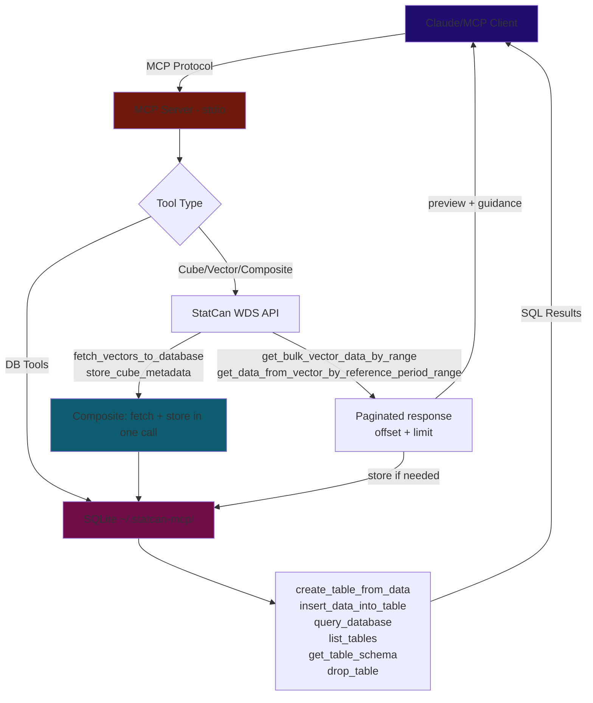
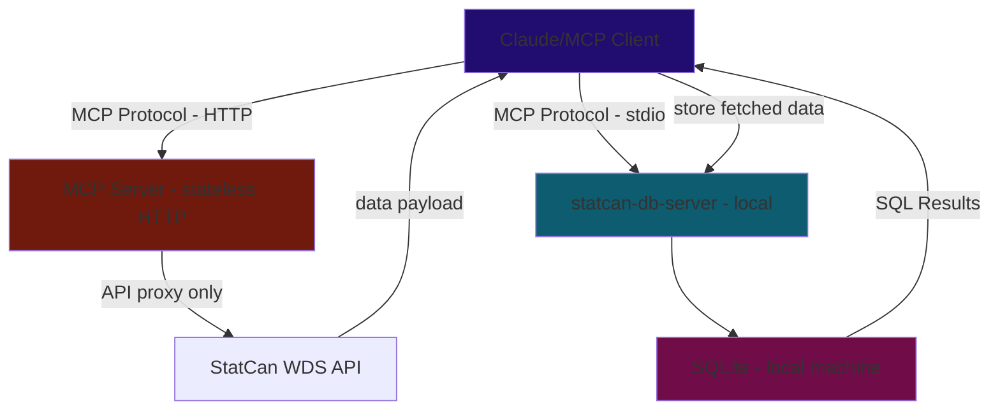

# Roadmap & Implementation Status
*Updated Feb 26, 2026*

---

## Up Next — Infrastructure

### 1. HTTP Branch — Catch Up + Stateless Architecture

The `http` branch has Streamable HTTP + Google OAuth but is behind `main` by several versions. Before adding features it needs to merge everything from `main`.

**Target architecture (stateless server):**
- Server is a pure API proxy — fetches StatCan data and returns it, stores nothing server-side
- DB tools are excluded from the HTTP build entirely
- Each user's client manages its own local SQLite
- This unlocks hosting on Render, Railway, Cloudflare Workers without per-user storage concerns
- Required for MCP Apps (needs HTTP transport)

**Steps:**
- [ ] Merge `main` into `http` branch (bring in all v0.1.x and v0.2.0 fixes)
- [ ] Strip DB tools from the HTTP server build (`register_db_tools` not called in HTTP mode)
- [ ] Audit composite tools — `fetch_vectors_to_database` and `store_cube_metadata` use local SQLite; exclude or replace with pure-return variants for HTTP mode
- [ ] Verify Google OAuth flow still works after merge
- [ ] Deploy to Render/Railway as a public free-tier instance

### 2. Client-Side SQLite (Remote Use Case)

When the server is remote and stateless, the LLM client still needs somewhere to store fetched data for the store-then-query pattern to work. Options:

**Option A — Client manages its own local SQLite (preferred)**
The MCP client (Claude Desktop, Claude Code) runs a local `statcan-db` MCP server alongside the remote `statcan` HTTP server. The remote server handles API fetching; the local DB server handles storage and querying. The LLM orchestrates across both.

- [ ] Publish a minimal `statcan-db-server` package — just the DB tools (create, insert, query, list, schema, drop), no API tools
- [ ] User wires both servers in their MCP config: remote statcan for data + local statcan-db for storage
- [ ] This is the cleanest separation: fetch is stateless and hostable, storage is local and private

**Option B — Return data to client, let client store**
HTTP build returns full data payloads (no auto-store). LLM uses a separate local DB tool to store. Already works today if the user has the local stdio build running alongside. No new code needed — just documentation.

**Option C — Remote DB (DynamoDB, Turso, etc.)**
Per-user cloud storage. Significant ops complexity, cost, and privacy concerns. Not worth it for this use case.

*Recommended path: ship Option A after the HTTP branch is stable.*

### 3. MCP Apps — Data Visualization *(post-HTTP)*

Return interactive HTML charts/dashboards in-chat. Blocked on:
- No Python MCP SDK support yet (JS only as of Feb 2026)
- Requires HTTP transport (stdio can't serve HTML resources back)
- Limited host support — only a few MCP clients render `ui://` resources

**What this would look like:**
- `visualize_table(table_name, chart_type)` — queries local SQLite, returns an interactive Chart.js or Plotly chart as an MCP App resource
- `create_dashboard(tables, layout)` — multi-panel view combining time series, bar charts, and summary stats
- Text fallback for clients that don't support MCP Apps

**Unblocked when:** HTTP branch is stable + Python SDK ships MCP Apps support.

---

## Quality

- [ ] **Enable SSL verification** — `VERIFY_SSL = False` is a security risk
- [ ] **CI/CD linting** — ruff + mypy on push/PR
- [ ] **Expand tests** — mock StatCan API responses; per-tool coverage (currently only truncation is tested)

---

## Distribution

- [ ] **Register on Smithery.ai** — one-click install button
- [ ] **Submit to directories** — `punkpeye/awesome-mcp-servers`, PulseMCP
- [ ] **Multi-client config snippets** — Cursor, VS Code Copilot, Windsurf in README
- [ ] **Windows setup guide** — needs testing on Windows VM first
- [ ] **Dockerfile** — for Docker MCP Catalog listing

---

## Future / Exploratory

- [ ] **SDMX implementation** — REST + SDMX tools for richer data access
- [ ] **A2A + MCP** — multi-agent system exploration
- [ ] **Scheduled reports** — periodic LLM calls for weekly dataset summaries
- [ ] **Caching** — time-based invalidation aligned to StatCan's 8:30 AM ET update schedule

---

## Completed

### Context Window Overflow — v0.2.0 *(Feb 26, 2026)*
- [x] **`summarize_cube_metadata` default reduced 20 → 5** — `DEFAULT_MEMBER_LIMIT = 5` in `src/util/truncation.py`; 2 new tests added (15 total)
- [x] **Footnote stripping in summary mode** — `summarize_cube_metadata` replaces the full `footnote` array with a count string (e.g., `"[20 footnotes omitted. Set summary=False to include them.]"`). Footnotes were the dominant response size contributor on data-rich cubes like CPI (18100004).
- [x] **`store_cube_metadata(pid)` composite tool** — fetches full metadata, stores into `_statcan_dimensions` + `_statcan_members`; returns compact summary only. Tables shared across pids, idempotent via `DELETE WHERE pid = ?`. Lives in `composite_tools.py` alongside `fetch_vectors_to_database`.
- [x] **`get_cube_metadata` docstring updated** — now points LLMs to `store_cube_metadata` for full member browsing without context cost

### Context Overflow & Truncation *(Feb 25, 2026)*
- [x] **Shared truncation utility** — `src/util/truncation.py`: `truncate_response`, `truncate_with_guidance`, `summarize_cube_metadata`; 13 unit tests
- [x] **`get_cube_metadata` summary mode** — `summary=True` (default) caps dimension member lists at 5; `summary=False` returns full response with all vectorIds and footnotes
- [x] **Cube list pagination** — `get_all_cubes_list` / `get_all_cubes_list_lite` paginated via `CubeListInput(offset, limit=100)`
- [x] **Search result cap** — `search_cubes_by_title` via `CubeSearchInput(max_results=25)`; count message when more exist
- [x] **Bulk coord truncation + guidance** — `get_series_info_from_cube_pid_coord_bulk` paginates + injects `_guidance` for code-set resolution
- [x] **Research: cursor-based pagination** — concluded it doesn't solve the problem; context overflow is caused by data accumulating in the window, not pagination inconsistency. Store-then-query is the correct direction.

### High-Priority Fixes *(Feb 25, 2026)*
- [x] **Bump `mcp>=1.3.0,<2`** — fixes protocol version mismatch; unlocks concurrent requests, Lifespan API, server `instructions` field
- [x] **Smart truncation for vector tools** — replaced auto-store with offset/limit pagination in `get_bulk_vector_data_by_range` and `get_data_from_vector_by_reference_period_range`
- [x] **Bulk coord tool** — `get_series_info_from_cube_pid_coord_bulk` accepts array of `{productId, coordinate}` pairs; eliminates N sequential HTTP calls
- [x] **Registry `$defs` support** — `ToolRegistry` includes `$defs` in inputSchema for nested Pydantic models
- [x] **DB path fix** — `config.py` uses `pwd.getpwuid(os.getuid()).pw_dir` instead of `os.path.expanduser`; `--db-path` CLI flag

### Core Data-Fetching Fixes *(Feb 25, 2026)*
- [x] `create_table_from_data` creates schema + inserts rows in one call
- [x] `fetch_vectors_to_database` composite tool — fetch + store in SQLite in a single call
- [x] Rewrote tool docstrings with workflow hints steering LLMs toward bulk vector pattern
- [x] Stable DB path at `~/.statcan-mcp/statcan_data.db`

### Distribution & Publishing *(Feb 23, 2026)*
- [x] PyPI — `pip install statcan-mcp-server` / `uvx statcan-mcp-server`; Trusted Publishing via GitHub OIDC
- [x] MCP Registry — `io.github.Aryan-Jhaveri/mcp-statcan`
- [x] GitHub Actions CI/CD — auto-publishes on push to `main`
- [x] Flatten `get_bulk_vector_data_by_range` — flat list with `vectorId` injected per data point
- [x] Full StatCan WDS API coverage (~15 tools)
- [x] In-memory TTL cache for `search_cubes_by_title`
- [x] SQLite database layer — create, insert, query, list, schema, drop tools
- [x] `drop_table` MCP tool — LLMs can permanently delete tables to free DB space
- [x] `query_database` hardened — `PRAGMA query_only = ON` enforces read-only at SQLite engine level

---

## Architecture & Data Flow

### Current (stdio / local)

### Target (HTTP / remote + client-side SQLite)

