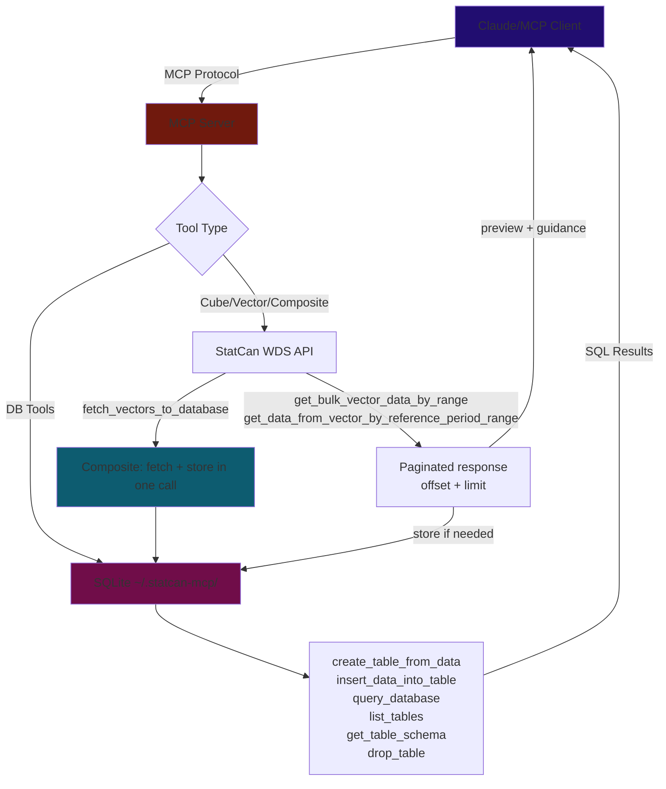

# Roadmap & Implementation Status
*Updated Feb 25, 2026*

---

## Up Next

### 1. Stateless Mode for Remote/HTTP Deployment

The `http` branch has Streamable HTTP + Google OAuth but is behind `main`. Before adding features, it needs to catch up.

**Architecture:** Don't store anything server-side. Many MCP clients already have local SQLite. The server fetches StatCan data and returns it; the client decides whether to store it. DB tools become optional or excluded from the remote build.

### 2. MCP Resources

Expose static reference content clients can browse without tool calls:
- StatCan data model explainer (cubes, vectors, coordinates, reference periods)
- Subject category taxonomy
- Code sets reference (unit/scalar/frequency definitions)

### 3. MCP Apps — Data Visualization *(post-v1.0)*

Return interactive HTML charts/dashboards in-chat. Blocked on: no Python SDK support, requires HTTP transport, limited host support. Only viable after the HTTP branch is stable and stateless.

---

## Quality

- [ ] **Enable SSL verification** — `VERIFY_SSL = False` is a security risk
- [ ] **CI/CD linting** — ruff + mypy on push/PR
- [ ] **Expand tests** — mock StatCan API responses; per-tool coverage

---

## Distribution

- [ ] **Register on Smithery.ai** — one-click install button
- [ ] **Submit to directories** — `punkpeye/awesome-mcp-servers`, PulseMCP
- [ ] **Multi-client config snippets** — Cursor, VS Code Copilot, Windsurf in README
- [ ] **Windows setup guide** — needs testing on Windows VM first
- [ ] **Dockerfile** — for Docker MCP Catalog listing

---

## Future / Exploratory

- [ ] **SDMX implementation** — REST + SDMX tools for richer data access
- [ ] **A2A + MCP** — multi-agent system exploration
- [ ] **Scheduled reports** — periodic LLM calls for weekly dataset summaries
- [ ] **Caching** — time-based invalidation aligned to StatCan's 8:30 AM ET update schedule

---

## Completed

### Context Overflow & Truncation *(Feb 25, 2026)*
- [x] **Shared truncation utility** — `src/util/truncation.py`: `truncate_response`, `truncate_with_guidance`, `summarize_cube_metadata`; 13 unit tests
- [x] **`get_cube_metadata` summary mode** — `summary=True` (default) caps dimension member lists at 20; `summary=False` returns full response with all vectorIds
- [x] **Cube list pagination** — `get_all_cubes_list` / `get_all_cubes_list_lite` paginated via `CubeListInput(offset, limit=100)`
- [x] **Search result cap** — `search_cubes_by_title` via `CubeSearchInput(max_results=25)`; count message when more exist
- [x] **Bulk coord truncation + guidance** — `get_series_info_from_cube_pid_coord_bulk` paginates + injects `_guidance` for code-set resolution

### High-Priority Fixes *(Feb 25, 2026)*
- [x] **Bump `mcp>=1.3.0,<2`** — fixes protocol version mismatch; unlocks concurrent requests, Lifespan API, server `instructions` field
- [x] **Smart truncation for vector tools** — replaced auto-store with offset/limit pagination in `get_bulk_vector_data_by_range` and `get_data_from_vector_by_reference_period_range`
- [x] **Bulk coord tool** — `get_series_info_from_cube_pid_coord_bulk` accepts array of `{productId, coordinate}` pairs; eliminates N sequential HTTP calls
- [x] **Registry `$defs` support** — `ToolRegistry` includes `$defs` in inputSchema for nested Pydantic models
- [x] **DB path fix** — `config.py` uses `pwd.getpwuid(os.getuid()).pw_dir` instead of `os.path.expanduser`; `--db-path` CLI flag

### Core Data-Fetching Fixes *(Feb 25, 2026)*
- [x] `create_table_from_data` creates schema + inserts rows in one call
- [x] `fetch_vectors_to_database` composite tool — fetch + store in SQLite in a single call
- [x] Rewrote tool docstrings with workflow hints steering LLMs toward bulk vector pattern
- [x] Stable DB path at `~/.statcan-mcp/statcan_data.db`

### Distribution & Publishing *(Feb 23, 2026)*
- [x] PyPI — `pip install statcan-mcp-server` / `uvx statcan-mcp-server`; Trusted Publishing via GitHub OIDC
- [x] MCP Registry — `io.github.Aryan-Jhaveri/mcp-statcan`
- [x] GitHub Actions CI/CD — auto-publishes on push to `main`
- [x] Flatten `get_bulk_vector_data_by_range` — flat list with `vectorId` injected per data point
- [x] Full StatCan WDS API coverage (~15 tools)
- [x] In-memory TTL cache for `search_cubes_by_title`
- [x] SQLite database layer — create, insert, query, list, schema, drop tools
- [x] `drop_table` MCP tool — LLMs can permanently delete tables to free DB space
- [x] `query_database` hardened — `PRAGMA query_only = ON` enforces read-only at SQLite engine level

---

## Architecture & Data Flow

