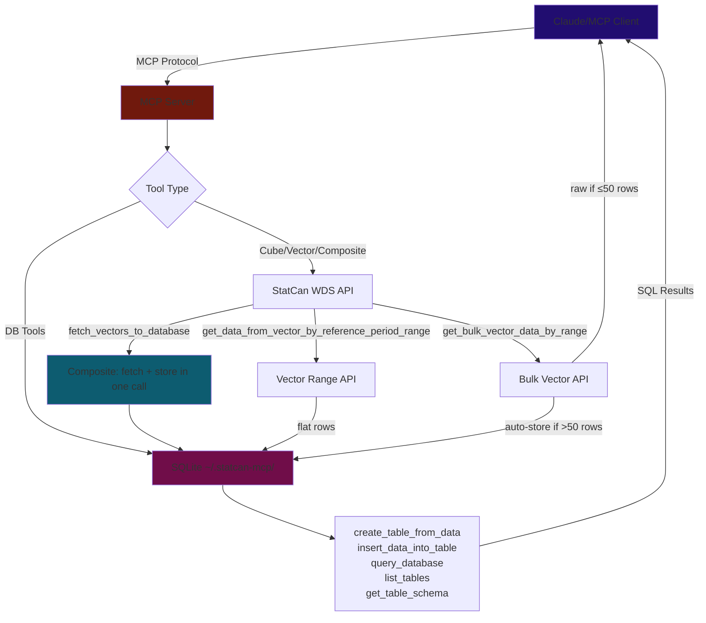

# Roadmap & Implementation Status
*Updated Feb 25, 2026*

---

## The Story So Far

The server works. LLMs can search cubes, fetch vector data, and store results in SQLite. But real-world usage exposed problems:

**Problem 1: Large responses blow up context.** A bulk vector fetch can return hundreds of rows. Dumping all of that into the LLM's context window wastes tokens and degrades reasoning. We added an "auto-store" that writes >50 rows to SQLite and returns a summary — but the LLM still has to know to call `query_database` afterward. It's not seamless.

**Problem 2: LLMs loop single-series calls.** When an LLM needs data for 10 different items, it often calls `get_series_info_from_cube_pid_coord` 10 times instead of using the bulk vector workflow. The docstrings try to steer it, but LLMs don't always read them carefully.

**Problem 3: Remote hosting breaks the storage model.** Right now everything runs locally via stdio with a single-user SQLite file. If we host the server on Render for mobile/remote users, SQLite on the server creates data isolation, persistence, and concurrency problems. The cleaner answer: **make the server stateless and let the client handle storage** — many MCP clients (Claude Desktop, Claude Code, Cursor) already have their own SQLite tools.

---

## Up Next

### 1. Smart Truncation for Large Results (High Priority)

**The problem:** When a tool returns 500+ rows, either the context overflows or we silently dump data into SQLite and hope the LLM figures out what happened.

**The fix:** Instead of auto-storing, return a useful preview:

- Show the **first 50 rows** as data
- Append a clear message: *"Showing 50 of 3,200 rows. Call again with `offset` and `limit` to get more."*
- Add `offset` and `limit` parameters to bulk tools (`get_bulk_vector_data_by_range`, `get_data_from_vector_by_reference_period_range`, `fetch_vectors_to_database`)
- In the truncation message, **guide the LLM** toward next steps:
  - *"To understand what this data means, call `get_code_sets()` for unit/scalar definitions"*
  - *"To get series metadata (titles, frequency, coordinates), call `get_series_info_from_vector` or the bulk version"*

This gives LLMs a head of data to reason about, a way to get more if needed, and a nudge toward metadata context. No silent side effects, no hidden SQLite tables.

**What this replaces:** The current auto-store behavior in `get_bulk_vector_data_by_range` (the `BULK_AUTO_STORE_THRESHOLD = 50` code path). That code creates a random `bulk_<uuid>` table that the LLM has to discover. Truncation with guidance is more predictable.

**Impact on DB tools:** The SQLite tools (`create_table_from_data`, `query_database`, etc.) stay in the server for local/stdio users who want them. The composite `fetch_vectors_to_database` tool also stays — it's still useful when users explicitly want to store data. But truncation becomes the default for raw fetch tools instead of auto-store.

### 2. Bulk `get_series_info_from_cube_pid_coord` (High Priority)

**The problem:** `get_series_info_from_cube_pid_coord` takes one coordinate at a time. When an LLM needs metadata for 10 series, it makes 10 sequential HTTP calls. This is slow and burns through tool call budgets.

**The fix:** Accept an array of `{productId, coordinate}` pairs and batch them into a single API call (or parallel calls under the hood). Return all results at once.

This pairs with the truncation work above — when the LLM sees 50 rows of data with vector IDs but no context about what they mean, it should bulk-fetch the series info to understand the dimensions, units, and frequencies.

### 3. Bump `mcp>=1.3.0` (High Priority)

**The problem:** The current `mcp>=1.0.0` pin responds with protocol version `2025-06-18` while newer clients send `2025-11-25`. This causes a version mismatch warning.

**The fix:** Change one line in `pyproject.toml` to `mcp>=1.3.0,<2`. No code changes needed — our low-level `Server` class usage still works in all 1.x releases.

**What this unlocks:**
- **Concurrent request handling** — multiple tool calls can run in parallel (matters for async StatCan API calls)
- **Lifespan API** — initialize DB connections at startup instead of per-call
- **Server `instructions` field** — a place to tell clients about the StatCan data model without embedding it in every docstring
- Opens the door to **FastMCP migration** later (replaces our custom `ToolRegistry` with `@mcp.tool()` decorators), but that's optional — the registry works fine as-is

**Pin an upper bound.** v2 of the MCP SDK is in development and will have breaking changes. Use `<2` to stay safe.

### 4. Stateless Mode for Remote/HTTP Deployment (Medium Priority)

**The context:** The `http` branch has Streamable HTTP transport + Google OAuth. But it's behind `main` on data-handling fixes. Before adding features there, it needs to catch up with `main`.

**The architecture question:** When someone connects from their phone to a Render-hosted server, where does the data go?

- SQLite on the server means shared state between all users, ephemeral filesystem on Render's free tier, and write contention
- Per-user SQLite with OAuth identity scoping is possible but adds complexity
- **Simplest answer: don't store anything server-side.** Many MCP clients already have local SQLite (Claude Desktop via sqlite MCP server, Claude Code via bash, Cursor, etc.). The server just fetches StatCan data and returns it. The client decides whether to store it locally.

**What this means for the `http` branch:**
- DB tools become optional or are excluded from the remote deployment
- `fetch_vectors_to_database` either becomes `fetch_vectors` (no DB step) or stays as a convenience for local/stdio mode
- The smart truncation from item #1 becomes the primary way to handle large results — no server-side storage fallback needed

### 5. MCP Resources (Medium Priority)

Requires `mcp>=1.3.0` (item #3 above).

MCP Resources let the server expose static reference content that clients can browse without calling tools. Good candidates:

- **StatCan data model explainer** — what cubes, vectors, coordinates, and reference periods mean
- **Subject categories** — the StatCan subject taxonomy so LLMs know what data exists
- **Code sets reference** — unit/scalar/frequency definitions (currently a tool call, could be a static resource). Ideally tool to make sure we're updated on whats on the API.

This would reduce tool calls for context-gathering. Instead of the LLM calling `get_code_sets()` every time, the client can pre-load the resource.

### 6. MCP Apps — Data Visualization (Future)

MCP Apps let tools return interactive HTML UIs rendered in the chat (charts, tables, dashboards). High value for a data server — imagine asking "show me CPI over time" and getting an interactive chart.

**Blockers:**
- No Python SDK support — all tooling is TypeScript only. Would need manual protocol implementation.
- Requires HTTP transport (not stdio) — the host needs to fetch `ui://` resources.
- Host support is limited — Claude web, Claude Desktop, VS Code Copilot, a few others.

**Sequence:** Only makes sense after HTTP transport is stable and the server is stateless. This is a post-v1.0 feature.

---

## Quality

- [ ] **Enable SSL verification** — `VERIFY_SSL = False` is a security risk
- [ ] **SQL validation** — currently `startswith("select")` only; should whitelist operations and add query size limits
- [ ] **CI/CD linting** — ruff + mypy on push/PR
- [ ] **Write tests** — pytest unit tests per tool, mock StatCan API responses

---

## Distribution

- [ ] **Register on Smithery.ai** — one-click install button
- [ ] **Submit to directories** — `punkpeye/awesome-mcp-servers`, PulseMCP
- [ ] **Multi-client config snippets** — Cursor, VS Code Copilot, Windsurf in README
- [ ] **Windows setup guide** — needs testing on Windows VM first
- [ ] **Dockerfile** — for Docker MCP Catalog listing

---

## Future / Exploratory

- [ ] **SDMX implementation** — REST + SDMX tools for richer data access. An SDMX Skills collection could be an alternative implementation, with agents using their own SQLite within the chat and results displayed via MCP Apps.
- [ ] **A2A + MCP** — multi-agent system exploration
- [ ] **Scheduled reports** — periodic LLM calls for weekly dataset summaries
- [ ] **Caching** — time-based invalidation aligned to StatCan's 8:30 AM ET update schedule

---

## Completed

### Core LLM Data-Fetching Fixes *(Feb 25, 2026)*
- [x] `create_table_from_data` now inserts rows — creates schema + inserts all data in one call
- [x] Rewrote tool descriptions with workflow hints — steering LLMs toward bulk vector workflow
- [x] Added `fetch_vectors_to_database` composite tool — single call: fetch + store in SQLite
- [x] Auto-store large bulk responses — `get_bulk_vector_data_by_range` stores to SQLite when >50 rows *(to be replaced by smart truncation)*
- [x] Stable DB path — `~/.statcan-mcp/statcan_data.db`; `--db-path` flag and `STATCAN_DB_FILE` env var

### Distribution & Publishing *(Feb 23, 2026)*
- [x] PyPI — `pip install statcan-mcp-server` / `uvx statcan-mcp-server`; Trusted Publishing via GitHub OIDC
- [x] MCP Registry — registered as `io.github.Aryan-Jhaveri/mcp-statcan`
- [x] GitHub Actions CI/CD — auto-publishes to PyPI + MCP Registry on `v*` tag push
- [x] Console entry point — `statcan-mcp-server` command
- [x] Flatten `get_bulk_vector_data_by_range` response — flat list with `vectorId` injected
- [x] Full StatCan WDS API coverage — cube, vector, metadata tools (~15 total)
- [x] In-memory TTL cache for `search_cubes_by_title`
- [x] SQLite database layer — create, insert, query, list, schema tools

---

## Development Log

### Feb 25, 2026 — LLM Data-Fetching Overhaul
- Fixed three root-cause bugs in how LLMs interact with the server:
  - Merged `create_table_from_data` create+insert into one step
  - Added `fetch_vectors_to_database` composite tool
  - Auto-store large bulk responses to prevent context overflow
- Rewrote tool docstrings to steer LLMs toward bulk vector workflow
- Fixed DB path to be absolute (`~/.statcan-mcp/`) so it's consistent regardless of working directory
- Added `--db-path` CLI flag

### Feb 23, 2026 — PyPI & MCP Registry Publishing
- Created `server.json`, validated against MCP Registry schema
- GitHub Actions workflow for automated PyPI + MCP Registry publishing on `v*` tags
- PyPI Trusted Publishing (OIDC) — no API tokens needed
- Tagged `v0.1.1` for first automated release

### Jan 7, 2026
- More detailed tool prompts to reduce separate fetch/insert calls

### Jan 2, 2026 — Flatten Bulk Response
- Identified `get_bulk_vector_data_by_range` returning nested JSON incompatible with DB tools
- Flattened to list of data points with `vectorId` injected at top level

---

## Architecture & Data Flow

