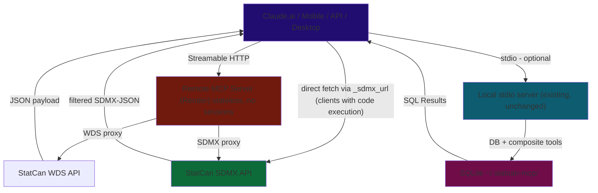

# Roadmap

*Updated Mar 2, 2026*

- [ ] **`save_to_table` param on SDMX tools** — add optional `save_to_table: str` to `get_sdmx_data` / `get_sdmx_vector_data`; saves rows to SQLite, returns 5-row head + table name. Eliminates batched fetches and context bloat for large dimensions. See `docs/llm-efficiency-research.md`.
- [ ] **`get_sdmx_key_for_dimension` tool** — given `productId` + `dimension_id`, return all leaf member IDs as a ready-to-use OR key string. Eliminates manual memberId extraction scripts. See `docs/llm-efficiency-research.md`.
- [ ] **SDMX key semantics in docstring** — add inline warning to `get_sdmx_data`: wildcard returns sparse sample for large dimensions; use explicit WDS memberIds (from `get_cube_metadata`) not SDMX codelist positions for reliable results.
- [ ] **Full cube list pre-fetch** — download all cube list so wildcarding allow llm to find stuff from the file instead of having to call functions to search online multiple times
- [ ] **Full cube pre-fetch** — download all cube metadata to local DB for fully offline browsing
- [ ] **SDMX Wildcarding + Repeated calls** - 406 errors for smaller models, the LLM has to do multiple SDMX fetch data call, adding on to context bloat. The LLM needs SDMX wildcarding directions. 

Example call by Gemini Flash. 
{
  "key": "1.1.3.1.1.1.1+2+3+4",
  "productId": 37100163,
  "startPeriod": "2023"
}

---

## Open Problems

### LLM Data Output — Hardcoded Values & Context Bloat

**Problem observed (two variants):**
1. When an LLM calls `get_sdmx_data` and receives 73+ rows of data, it hardcodes every value into artifacts as literal arrays — error-prone and prevents dynamic queries.
2. When fetching large hierarchical dimensions (e.g., 162 NOC minor groups), the LLM falls back to 9+ sequential batched calls, each returning large JSON responses that consume the context window. Aggregation then has to happen mentally from context.

**Case study:** See `docs/llm-efficiency-research.md` — NOC employment query for New Brunswick that required 17+ tool calls where 3 would suffice.

**Confirmed approach: Approach A (`save_to_table`) — implement this**

Add an optional `save_to_table: str` parameter to `get_sdmx_data` and `get_sdmx_vector_data`. When provided, save all rows to SQLite and return only a 5-row head + table metadata. The LLM then uses `query_database` to aggregate, filter, and rank.

- **Works for:** stdio mode (has DB tools)
- **Doesn't help:** HTTP mode (no DB tools registered) — acceptable trade-off
- **Complexity:** Low — reuses existing `create_table_from_data` pattern from `fetch_vectors_to_database`
- **Replaces:** 9 sequential batch fetches + mental aggregation → 1 fetch + 1 SQL query

**Confirmed additional tool: `get_sdmx_key_for_dimension`**

New tool that accepts `productId` + `dimension_id` and returns all leaf codes as a ready-to-use OR key string. Eliminates the manual pattern of: `get_cube_metadata` → parse large file in bash → extract member IDs → build `+`-joined string.

**Approach B — Upstream: URL + SDMX decoding context** (deprioritised)

The LLM already gets `_sdmx_url` in every SDMX tool response. CORS blocks browser-based direct fetching. Only useful for Python sandbox clients. Keeping as a future option but not the immediate priority.

---

### Phase 3 — MCP Resources & Prompts for SDMX

Expose SDMX URL construction as MCP primitives — supplementary to tools, not a replacement.

- **Resource template:** `sdmx://statcan/data/{productId}/{key}` → resolves to constructed SDMX URL + usage instructions
- **Prompt:** "SDMX data analysis" → reusable template with step-by-step URL construction guide, format notes, Python usage examples

These are additive — registered alongside tools in `create_server()`, no architectural change needed.

- [ ] Add `server.list_resources()` / `server.read_resource()` handlers
- [ ] Add `server.list_prompts()` / `server.get_prompt()` handlers
- [ ] SDMX URL construction prompt with Python usage examples

---

### Phase 4 — MCP Apps / Data Visualization

Return interactive HTML charts/dashboards in-chat via `ui://` resources.

Additive primitive — new module `src/api/app_tools.py` registered in `create_server()`. Visualization tools query local SQLite, so they live in the stdio server only (excluded from HTTP mode, consistent with DB tools split).

**Current blockers:**
- Python MCP SDK does not yet support MCP Apps (JS SDK only, as of Feb 2026)
- Requires HTTP transport (stdio cannot serve HTML resources back to client)
- Limited host support — few MCP clients render `ui://` resources

**Unblocked when:** Phase 2 deployed + Python SDK ships MCP Apps support.

---

## Backlog

### Quality

- [ ] **Enable SSL verification** — `VERIFY_SSL = False` is a security risk
- [ ] **CI/CD linting** — ruff + mypy on push/PR
- [ ] **Expand tests** — mock StatCan API responses; per-tool coverage (currently only truncation + sdmx_json tested)

### Distribution

- [x] **Render deployment** — covered by Phase 2 remaining items
- [ ] **Register on Smithery.ai** — one-click install button
- [ ] **Submit to directories** — `punkpeye/awesome-mcp-servers`, PulseMCP
- [ ] **Multi-client config snippets** — Cursor, VS Code Copilot, Windsurf, Claude.ai Custom Connector in README
- [ ] **Windows setup guide** — needs testing on Windows VM first
- [ ] **Dockerfile** — for Docker MCP Catalog listing; also useful for Render (alternative to Procfile)

### Exploratory

- [ ] **A2A + MCP** — multi-agent system exploration
- [ ] **Scheduled reports** — periodic LLM calls for dataset summaries
- [ ] **Caching aligned to StatCan update schedule** — time-based invalidation at StatCan's 8:30 AM ET release cadence

## Architecture & Data Flow

### Current

```mermaid
flowchart TD
    A[Claude.ai / Mobile / API / Desktop] -->|Streamable HTTP| B["Remote MCP Server (Render) stateless, no sessions"]
    A -->|stdio - optional| DB["Local stdio server (existing, unchanged)"]
    A -->|"direct fetch via _sdmx_url (clients with code execution)"| S[StatCan SDMX API]

    B -->|WDS proxy| D[StatCan WDS API]
    B -->|SDMX proxy| S
    D -->|JSON payload| A
    S -->|filtered SDMX-JSON| A

    DB -->|DB + composite tools| E[SQLite ~/.statcan-mcp/]
    E -->|SQL Results| A

    style A fill:#210d70
    style B fill:#70190d
    style DB fill:#0d5c70
    style E fill:#700d49
    style S fill:#0d6b3a
```
