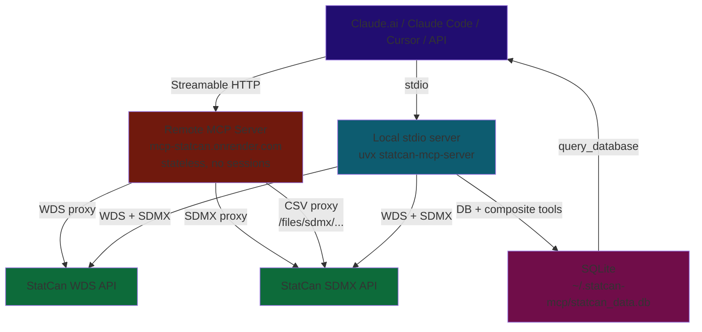

# Implementation Status & Roadmap

*Updated April 9, 2026*

---

## What's Shipped

### v0.5.0 — Sandbox Research Priorities (Apr 2026)
*Branch: `feat/sandbox-research-impl` → merged to `main`*

- **`get_sdmx_key_for_dimension`** — new tool: fetches full SDMX codelist for a dimension, returns all leaf codes as a ready-to-use `+`-joined OR key string. Eliminates the 9-batch-call pattern for large dimensions (e.g., 162 NOC minor groups). 

- **`get_sdmx_data` wildcard warning** — docstring now has an explicit `IMPORTANT — key position codes` block warning that wildcard (`.`) returns a sparse sample for dimensions with >30 codes, and points to `get_sdmx_key_for_dimension`.
- **MCP Prompts** — `statcan-data-lookup` and `sdmx-key-builder` registered in both stdio and HTTP modes. Appear as slash commands in Claude.ai web.
- **CSV download proxy** — `/files/sdmx/{product_id}/{key}` Starlette route on the HTTP server: stateless StatCan SDMX → flattened CSV. `get_sdmx_data` returns `download_csv` URL + 5-row head instead of inline data when `row_count > FILE_THRESHOLD` (50) and `RENDER_BASE_URL` is set. See **Known Issues** — this requires the env var to be configured on Render.
- **`_parse_structure_xml` name field** — each dimension entry now includes the codelist's English name (used by `get_sdmx_key_for_dimension`).

### v0.4.x — SDMX Phase 1 + HTTP Transport (Feb–Mar 2026)

- **SDMX tools** — `get_sdmx_structure`, `get_sdmx_data`, `get_sdmx_vector_data`
- **SDMX-JSON decoder** — `flatten_sdmx_json()` in `util/sdmx_json.py`; handles annual/monthly period decoding, attribute decoding, null values
- **OR-query series key bug fix** — `_fix_or_series_keys()` corrects StatCan's non-standard series key encoding for both solo-code (Bug A) and OR-query (Bug B) cases
- **HTTP transport** — `--transport http` flag; Starlette + StreamableHTTPSessionManager; stateless, no DB tools, CORS open
- **Streamable HTTP** — Render deployment at `mcp-statcan.onrender.com`
- **3 WDS tools deregistered** — `get_data_from_cube_pid_coord_and_latest_n_periods`, `get_data_from_vectors_and_latest_n_periods`, `get_data_from_vector_by_reference_period_range` (replaced by SDMX tools; decorators commented, functions kept)
- **Test suite** — 32 tests passing: `test_truncation.py` (17), `test_sdmx_json.py` (7), others

### v0.3.x and earlier — WDS Foundation

- WDS cube discovery, metadata, series resolution, change detection
- Vector tools: bulk range fetch, changed series
- Composite tools: `fetch_vectors_to_database`, `store_cube_metadata`
- SQLite database layer (`~/.statcan-mcp/statcan_data.db`)
- `ToolRegistry` decorator → MCP Tool schema
- TTL cache for cube list (1-hour)
- stdio transport (Claude Desktop / Claude Code)

---

## Known Issues & Constraints

### Active Constraints (won't fix soon)

| Issue | Detail |
|---|---|
| `VERIFY_SSL = False` | All httpx calls disable SSL verification — known security risk, StatCan cert issues made this necessary |
| `lastNObservations` + `startPeriod`/`endPeriod` → 406 | StatCan SDMX rejects combining these params; enforced with `ValueError` in both SDMX data tools |
| SDMX Geography labels broken for OR queries | StatCan uses non-standard series key encoding for multi-series OR queries; `_fix_or_series_keys()` fixes period and non-OR dim labels, but Geography labels in series 2+ remain wrong. Workaround: use wildcard for Geography, OR for other dims. 
| Wildcard returns sparse/wrong data for large dims | Confirmed for NOC (309 codes): wildcard returned 31 misaligned rows. Always use explicit member IDs for dims with >30 codes. `get_sdmx_key_for_dimension` provides the OR key. |
| CSV proxy requires `RENDER_BASE_URL` env var | `get_sdmx_data`'s large-response CSV redirect only activates when `RENDER_BASE_URL` is set in the environment. Must be configured on Render dashboard: `RENDER_BASE_URL=https://mcp-statcan.onrender.com` |

---

## What's Next

### Priority 1 — `save_to_table` on `get_sdmx_data` / `get_sdmx_vector_data` (stdio only)

Add optional `save_to_table: str` parameter. When provided: write all rows to SQLite via `create_table_from_data`, return `{table, rows, columns, head}` instead of inline data. LLM then uses `query_database` for aggregation.

- **Replaces:** 9 sequential batch fetches + mental aggregation → 1 fetch + 1 SQL query
- **Only for stdio mode** — HTTP mode has no DB tools (consistent with existing split)
- **Location:** `src/api/sdmx/sdmx_tools.py`, `src/models/sdmx_models.py`
- **Reuses:** `create_table_from_data` from `db/schema.py` (already used in `fetch_vectors_to_database`)
- **Effort:** ~3 hrs

### Priority 2 — Set `RENDER_BASE_URL` on Render

The CSV proxy is implemented but dormant until this env var is set. One-line config change on the Render dashboard. No code change needed.

### Priority 3 — MCP Resources

Expose SDMX URLs and SQLite tables as addressable resources.

- `statcan://sdmx/{productId}/{key}` → constructed SDMX URL + usage instructions (HTTP mode)
- `statcan://table/{name}` → SQLite table reference for multi-turn dataset reuse (stdio only)
- Register `server.list_resources()` / `server.read_resource()` handlers in `create_server()`
- Additive — no architectural change needed
- **Effort:** ~4 hrs

### Priority 4 — Full Cube List Pre-fetch

Download and cache the full `getAllCubesListLite` response at startup so discovery queries hit local data instead of the network. Reduces tool calls for the search → pick → fetch pattern.

- Cache to SQLite on first run, refresh on TTL (aligned to StatCan's 8:30 AM ET release cadence)
- **Location:** `util/cache.py` + `api/cube/discovery.py`
- **Effort:** ~3 hrs

---

## Backlog

### Quality

- [ ] **Enable SSL verification** — needs investigation into StatCan cert issues first
- [ ] **CI/CD linting** — ruff + mypy on push/PR (GitHub Actions)
- [ ] **Expand tests** — see `CLAUDE.md` Testing Plan for prioritized list; `test_coordinate.py`, `test_sql_helpers.py`, `test_sdmx_structure.py` are easiest next targets (pure functions, no mocking)

### Distribution

- [ ] **Register on Smithery.ai** — one-click install button
- [ ] **Submit to directories** — `punkpeye/awesome-mcp-servers`, PulseMCP
- [ ] **Multi-client config snippets** — Cursor, VS Code Copilot, Windsurf, Claude.ai Custom Connector in README
- [ ] **Windows setup guide** — needs testing on Windows VM first
- [ ] **Dockerfile** — for Docker MCP Catalog listing; also useful for Render

### Exploratory

- [ ] **MCP Apps / Data Visualization** — blocked: Python SDK does not yet support MCP Apps (JS only as of Apr 2026); requires HTTP transport + host support
- [ ] **A2A + MCP** — multi-agent system exploration
- [ ] **Caching aligned to StatCan 8:30 AM ET release cadence**

---

## Architecture & Data Flow

```mermaid
flowchart TD
    A[Claude.ai / Claude Code / Cursor / API] -->|Streamable HTTP| B["Remote MCP Server\nmcp-statcan.onrender.com\nstateless, no sessions"]
    A -->|stdio| DB["Local stdio server\nuvx statcan-mcp-server"]

    B -->|WDS proxy| D[StatCan WDS API]
    B -->|SDMX proxy| S[StatCan SDMX API]
    B -->|CSV proxy\n/files/sdmx/...| S

    DB -->|WDS + SDMX| D
    DB -->|WDS + SDMX| S
    DB -->|DB + composite tools| E[SQLite\n~/.statcan-mcp/statcan_data.db]

    E -->|query_database| A

    style A fill:#210d70
    style B fill:#70190d
    style DB fill:#0d5c70
    style E fill:#700d49
    style S fill:#0d6b3a
    style D fill:#0d6b3a
```

### Mode Comparison

| | HTTP (Render) | stdio (local) |
|---|---|---|
| Users | Claude.ai web, API, Cursor | Claude Desktop, Claude Code |
| DB tools | No | Yes |
| `save_to_table` | No | Yes (Priority 1) |
| CSV proxy | Yes (needs `RENDER_BASE_URL`) | N/A |
| MCP Prompts | Yes | Yes |
| SDMX tools | Yes | Yes |
| WDS tools | Yes | Yes |
